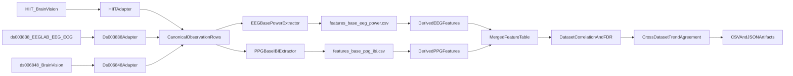
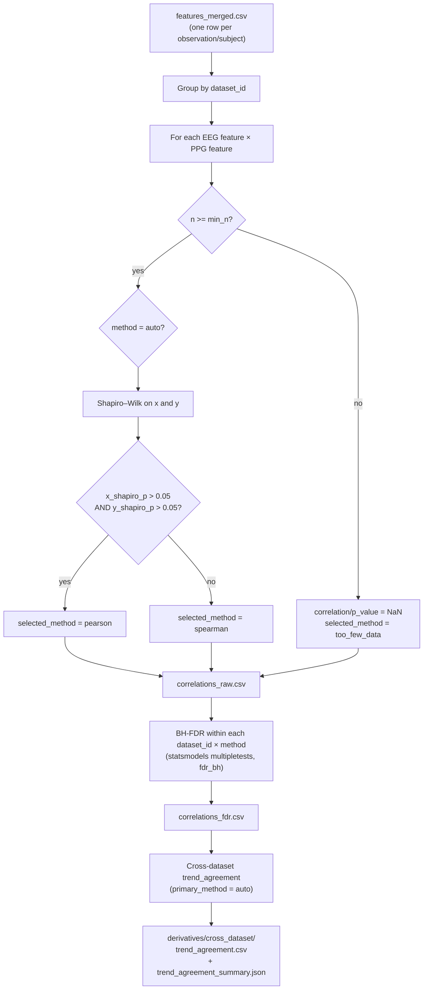

# Core Cross-Dataset EEG-PPG Pipeline

## Locked Scope
- Use only core EEG/PPG features that are available in all three datasets.
- Treat all inputs as upstream-cleaned (no ICA stage in this version).
- Deliver inter-subject EEG↔PPG correlation outputs per dataset, then a cross-dataset agreement summary.

## Existing Code To Reuse
- EEG preprocessing + feature primitives already exist in [`/Users/sarabonyadian/Documents/HIIT/ppg-eeg/ppg_eeg/eeg.py`](/Users/sarabonyadian/Documents/HIIT/ppg-eeg/ppg_eeg/eeg.py).
- PPG channel detection, peak detection, and HRV scalars exist in [`/Users/sarabonyadian/Documents/HIIT/ppg-eeg/ppg_eeg/ppg.py`](/Users/sarabonyadian/Documents/HIIT/ppg-eeg/ppg_eeg/ppg.py).
- Config and CLI scaffolding exist in [`/Users/sarabonyadian/Documents/HIIT/ppg-eeg/ppg_eeg/config.py`](/Users/sarabonyadian/Documents/HIIT/ppg-eeg/ppg_eeg/config.py) and [`/Users/sarabonyadian/Documents/HIIT/ppg-eeg/ppg_eeg/run.py`](/Users/sarabonyadian/Documents/HIIT/ppg-eeg/ppg_eeg/run.py).
- Existing EEG step-by-step checks can be reused as smoke validation in [`/Users/sarabonyadian/Documents/HIIT/ppg-eeg/tests`](/Users/sarabonyadian/Documents/HIIT/ppg-eeg/tests).

## Target Architecture

## Implementation Plan
1. Define a canonical observation schema used by all loaders.
- Add a dataset-agnostic record with fields like `dataset_id`, `subject_id`, `task_label`, `condition_label`, `eeg_path`, `ppg_source`, and `is_usable`.
- Keep HIIT-specific dimensions (`modality=PH|PS`, `timepoint=PRE|POST`, `state=rest|tetris`) as explicit columns rather than encoding them in filenames.

2. Add three dataset adapters that emit canonical observations.
- Create new modules under [`/Users/sarabonyadian/Documents/HIIT/ppg-eeg/ppg_eeg/datasets`](/Users/sarabonyadian/Documents/HIIT/ppg-eeg/ppg_eeg/datasets):
  - `hiit.py`: strict filename parser for `HIIT_{id}_{PH|PS}_{PRE|POST}[_T]` and exclusion of malformed/orphan files.
  - `ds003838.py`: pair `eeg/*.set` with `ecg/*.set` by subject+task (PPG channel from ECG modality).
  - `ds006848.py`: single BrainVision EEG file per task, with embedded PPG channel.
- Add shared adapter interface in `base.py` and registry in `__init__.py`.

3. Build a core feature extraction layer on top of existing primitives.
- Add a unified feature orchestrator module (for example [`/Users/sarabonyadian/Documents/HIIT/ppg-eeg/ppg_eeg/features_core.py`](/Users/sarabonyadian/Documents/HIIT/ppg-eeg/ppg_eeg/features_core.py)).
- Stage 1 writes only the required reusable base CSVs: `observations_index.csv`, `features_base_eeg_power.csv` (per-channel EEG band power), and `features_base_ppg_ibi.csv` (per-IBI PPG intervals).
- Stage 2 derives higher-level EEG/PPG feature tables, merged features, and correlations from those Stage 1 CSVs instead of rereading raw recordings.
- Core EEG v1 (shared): FM-theta, frontal beta, frontal alpha asymmetry, global alpha power, global beta power.
- Core PPG v1 (shared): mean HR, RMSSD, SDNN, mean RR, peak HR.
- Store both raw feature values and dataset-local robust z-scores so correlation patterns are comparable across datasets with different baselines.

4. Implement correlation + multiple-comparison analysis.
- Add analysis module (for example [`/Users/sarabonyadian/Documents/HIIT/ppg-eeg/ppg_eeg/correlation.py`](/Users/sarabonyadian/Documents/HIIT/ppg-eeg/ppg_eeg/correlation.py)) that computes pairwise EEG×PPG inter-subject correlations per dataset.
- Config defaults: `methods: [auto]`, `primary_method: auto`, `alpha: 0.05`, `min_n: 5`, `fdr_method: fdr_bh`.
- `auto` resolves to Pearson when both feature vectors pass Shapiro–Wilk (p > 0.05), otherwise Spearman.
- Apply Benjamini-Hochberg FDR within each dataset across all tested EEG×PPG pairs.
- Build a cross-dataset agreement artifact: sign consistency, effect-size rank, and count of datasets surviving FDR.

#### Correlation analysis flow

**Interpretation**

- **Unit of analysis:** inter-subject (across rows in `features_merged.csv`) within each dataset.
- **FDR scope:** all EEG×PPG pairs tested in that dataset (not pooled across HIIT / ds003838 / ds006848).
- **Replication rule:** same sign in all present datasets and FDR q < 0.05 in ≥ 2 datasets (`trend_agreement.csv`).

#### Correlation CSV schema (`correlations_fdr.csv`)

Primary analysis file: `derivatives/<dataset_id>/correlations_fdr.csv`  
(`correlations_raw.csv` is the same rows without FDR columns and significance flags.)

**Column order (human-readable export contract):**

| # | Column | Type | Description |
|---|--------|------|-------------|
| 1 | `dataset_id` | str | Dataset identifier (`hiit`, `ds003838`, `ds006848`) |
| 2 | `x_shapiro_p` | float | Shapiro–Wilk p-value for EEG feature vector (`auto` method only; NaN otherwise) |
| 3 | `y_shapiro_p` | float | Shapiro–Wilk p-value for PPG feature vector (`auto` method only; NaN otherwise) |
| 4 | `selected_method` | str | Resolved test: `pearson`, `spearman`, or `too_few_data` |
| 5 | `eeg_feature` | str | EEG feature column name from config |
| 6 | `ppg_feature` | str | PPG feature column name from config |
| 7 | `correlation` | float | Pearson r or Spearman ρ |
| 8 | `p_value` | float | Two-sided p-value for the chosen test |
| 9 | `sig_p_005` | bool | `p_value < 0.05` |
| 10 | `q_value` | float | BH-FDR adjusted p-value (q) within dataset |
| 11 | `sig_q_005` | bool | `q_value < 0.05` (primary inference threshold; heatmap `***`) |
| 12 | `sig_q_010` | bool | `q_value < 0.10` (heatmap `**`) |
| 13 | `sig_q_015` | bool | `q_value < 0.15` (heatmap `*`) |

**Supporting columns** (appended after the block above):

| Column | Description |
|--------|-------------|
| `method` | Config method label (e.g. `auto`) — used for FDR grouping and trend agreement filter |
| `n` | Count of finite paired observations used for the test |
| `reject_fdr` | Alias of `sig_q_005` when `alpha = 0.05` |

**Heatmap marker legend** (from `plot_correlation_heatmap`):

- `***` → `sig_q_005`
- `**` → `sig_q_010` (and not `sig_q_005`)
- `*` → `sig_q_015` (and not `sig_q_010`)
- `+` → `sig_p_005` only (exploratory; FDR not met at q < 0.15)

5. Wire the pipeline entrypoint and config for multi-dataset execution.
- Extend [`/Users/sarabonyadian/Documents/HIIT/ppg-eeg/ppg_eeg/config.py`](/Users/sarabonyadian/Documents/HIIT/ppg-eeg/ppg_eeg/config.py) to support `dataset_ids`, feature toggles, and output options.
- Replace scaffold logic in [`/Users/sarabonyadian/Documents/HIIT/ppg-eeg/ppg_eeg/run.py`](/Users/sarabonyadian/Documents/HIIT/ppg-eeg/ppg_eeg/run.py) with orchestration:
  - load adapters
  - run Stage 1 base extraction and write required base CSVs
  - run Stage 2 derivation from base CSVs
  - run correlations/FDR from merged Stage 2 features
  - write outputs.

6. Define output artifact contract for reproducibility.
- Write per-dataset files under `derivatives/<dataset_id>/`:
  - `observations_index.csv`
  - `features_base_eeg_power.csv`
  - `features_base_ppg_ibi.csv`
  - `features_eeg.csv`
  - `features_ppg.csv`
  - `features_merged.csv`
  - `correlations_raw.csv`
  - `correlations_fdr.csv` — pairwise EEG×PPG tests with columns:
    `dataset_id`, `x_shapiro_p`, `y_shapiro_p`, `selected_method`,
    `eeg_feature`, `ppg_feature`, `correlation`, `p_value`, `sig_p_005`,
    `q_value`, `sig_q_005`, `sig_q_010`, `sig_q_015`
    (plus `method`, `n`, `reject_fdr` as pipeline metadata)
- Write cross-dataset files under `derivatives/cross_dataset/`:
  - `trend_agreement.csv`
  - `trend_agreement_summary.json`

7. Validate with targeted tests and smoke runs.
- Add parser/unit tests for each adapter and feature-shape sanity checks in [`/Users/sarabonyadian/Documents/HIIT/ppg-eeg/tests`](/Users/sarabonyadian/Documents/HIIT/ppg-eeg/tests).
- Add one smoke config per dataset (small subject subset) from [`/Users/sarabonyadian/Documents/HIIT/ppg-eeg/config.example.yaml`](/Users/sarabonyadian/Documents/HIIT/ppg-eeg/config.example.yaml).
- Confirm each dataset produces non-empty EEG/PPG feature tables and an FDR-corrected matrix.

## Definition of Done
- One command runs the pipeline for all three datasets and writes deterministic artifacts.
- Core feature names and units are consistent across datasets.
- Correlation outputs include raw p-values, FDR-corrected q-values, and explicit significance flags at p < 0.05 and q < 0.05 / 0.10 / 0.15.
- A cross-dataset agreement report clearly indicates which EEG↔PPG trends replicate.