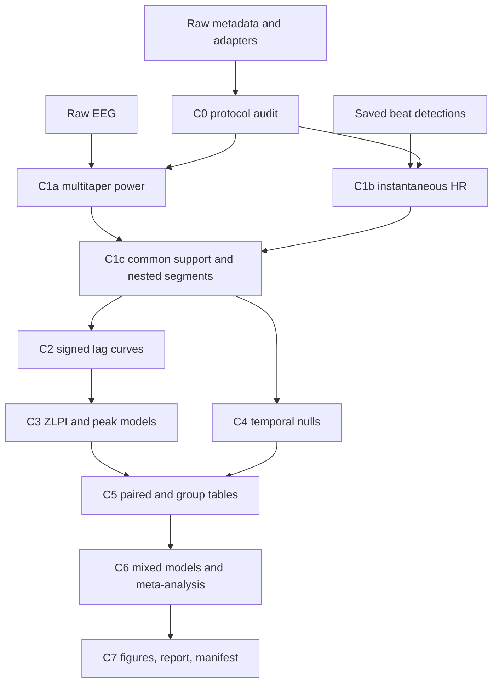

# Zero-Lag EEG–Heart Rate Pipeline Implementation Plan

## Status (2026-07-15)

| Milestone | Status | Notes |
|-----------|--------|-------|
| M1–M12 | **Done** | Package under `ppg_eeg/confirmatory/`; configs in `zero-lag-reanalysis-repo/` |
| M13a | **Done** | `production.py` modes: preflight / smoke / primary / sensitivity / clean_root; synthetic E2E under `derivatives/confirmatory_temporal_coupling/production/` |
| M13b | **Done (smoke)** | HIIT C0–C7 smoke artifacts at `derivatives/confirmatory_temporal_coupling/smoke/hiit_m13b/` (figures C7 present) |
| C-stage CLI | **Done** | `python -m ppg_eeg.confirmatory --config … --stage C0…C7\|all` (+ `--mode` for M13a ops) |
| Signal-processing audit | **Done** | R1–R3 Implemented; R4 ordinary within-segment z-score retained as documented Methods choice (no detrend / no robust temporal scaling without evidence) |
| Pairing audit | **Done** | P1/P4/P5 Implemented; P2 Accepted (Methods); **P3 Implemented** — primary meta gated to one prespecified contrast per primary dataset; HIIT/mindfulness/ds004582/ds003816 excluded; within-dataset IVW removed |
| Statistical Analysis audit | **Done** | S1–S4 Implemented; **S5/S6 not confirmatory requirements** — Methods = temporal surrogate nulls + equal four-band FDR; `PRIMARY_BAND=theta` display-only (no C6 dependency) |
| Robustness design | **Finalized** | Default = C4 temporal nulls + broadband + duration; optional CFA/nuisance via `--optional-artifact-controls` (off by default); single cardiac modality per dataset for HR |
| M13c–d | **Blocked** | Primary raw still incomplete for full-cohort lock (ds003838, ds006848, ds003690 missing). Figure 1 layout frozen; C7 publish now includes endpoint metrics — see `derivatives/confirmatory_temporal_coupling/review/figure1_publication_audit/FIGURE1_AUDIT.md`. |

**Duration contracts (frozen):** D240/D180 → ZLPI (±60); D120 → MWPI; D60 → SWPI; never pool MWPI/SWPI with ZLPI. Primary = D240 absolute-power ZLPI.

**Package path (authoritative):** `ppg_eeg/confirmatory/` (not under `temporal_coupling/`).

## 1. Executive summary

The current pipeline asks where the largest signed or absolute EEG–cardiac correlation occurs across lags, using Hilbert EEG envelopes and windowed HR/HRV. The confirmatory pipeline instead asks whether **instantaneous HR and frequency-resolved EEG power have a specific zero-lag excess** after accounting for distant-lag background correlation.

Build a parallel confirmatory path under [`ppg_eeg/confirmatory/`](ppg_eeg/confirmatory/) and keep the exploratory Stages 0–4 operational under [`ppg_eeg/temporal_coupling/`](ppg_eeg/temporal_coupling/). Reuse observation adapters, Stage 0 metadata, beat detectors, preprocessing primitives, output-layout helpers, lag-correlation functions, BH-FDR logic, circular-shift primitives, and plotting conventions. Replace only the confirmatory feature and inference layers:

- Hilbert envelopes → 2 s / 1 s-step DPSS multitaper power in theta 4–7, alpha 8–12, beta 13–29, gamma 30–45 Hz.
- 15 s windowed HR + HRV → PCHIP instantaneous HR reconstructed from clean accepted beats.
- Exploratory peak search → signed HR-only curves on a fixed ±60 s, 1 s lag grid.
- Peak-r inference → Fisher-z, ZLPI, local prominence, Gaussian peak parameters, paired contrasts, mixed models, random-effects meta-analysis, LOO, and temporal nulls.
- Existing Stage 4 event analysis → retained as legacy/supplementary only; it is not a dependency of the confirmatory path.



## 2. Gap analysis and disposition of existing stages

### Stage 0 — data audit: Modify

- Reuse [`data_audit.py`](ppg_eeg/temporal_coupling/data_audit.py), all adapters in [`ppg_eeg/datasets/`](ppg_eeg/datasets/), and `data_audit.csv` schema.
- Add a confirmatory audit that joins raw overlap, channel inventory, beat span, clean-beat count, nuisance channels, line frequency, paired-state availability, and eligibility at D240/D180/D120/D60.
- Add explicit exclusion codes: raw-short, beat-span-short, missing-state, sparse-beat, missing-EEG-feature, protocol-window, and modality-QC failure.
- Do not make Stage 0 depend on existing `usable_for_xcorr`, because that flag reflects windowed HR/HRV and exploratory envelope requirements.

### Stage 1A — EEG envelopes: Replace for confirmatory, preserve for legacy

- Keep [`eeg_envelope.py`](ppg_eeg/temporal_coupling/eeg_envelope.py) unchanged for exploratory reproducibility.
- Reuse `_read_raw`, `eeg_segment_bounds`, `preprocess_eeg`, ROI/config patterns, observation iteration, QC/error handling, and per-observation output layout.
- Add `confirmatory/multitaper_power.py`; do not add gamma to `eeg_envelope.py` or overload Hilbert output schemas.

### Stage 1B — cardiac HR/HRV: Modify and split

- Reuse detector/channel-selection paths in [`cardiac_detectors.py`](ppg_eeg/temporal_coupling/cardiac_detectors.py), IBI cleaning in [`cardiac_common.py`](ppg_eeg/temporal_coupling/cardiac_common.py), and `detected_peaks.csv` written by [`cardiac_timeseries.py`](ppg_eeg/temporal_coupling/cardiac_timeseries.py).
- Add `confirmatory/instant_hr.py`, which reads beat derivatives and never calls `compute_cardiac_timeseries()` for confirmatory HR.
- Keep RMSSD/SDNN files and code for legacy analyses, but remove HRV from confirmatory variable families and reports.

### Stage 1C — alignment: Modify

- Reuse `build_time_grid`, interpolation helpers, overlap calculations, z-score helpers, and QC conventions in [`resample.py`](ppg_eeg/temporal_coupling/resample.py).
- Add `confirmatory/harmonize.py` for feature intersection, clean contiguous blocks, deterministic nested segments, power-representation construction, and confirmatory QC.
- Do not force confirmatory columns into the legacy `features_temporal_aligned.csv` schema.

### Stage 1D — HIIT combine: Modify only for sensitivity

- Reuse participant/session parsing and source provenance from [`hiit_combine.py`](ppg_eeg/temporal_coupling/hiit_combine.py).
- Do not concatenate rest and Tetris into one signal before confirmatory estimation. Compute each state separately, then pair metrics within participant-session.

### Stage 2 — lagged cross-correlation: Modify

- Reuse `build_lag_grid`, `correlate_at_lag`, `compute_correlation_curve`, sign convention, finite-value masking, and overlap counts in [`cross_correlation.py`](ppg_eeg/temporal_coupling/cross_correlation.py).
- Add a configurable pair list and confirmatory writer rather than changing legacy `CARDIAC_VARS`/`EEG_VARS` globally.
- Disable exploratory positive-only/absolute peak selection for confirmatory inference. Save signed HR × band-power curves and per-lag `n_overlap`.

### Stage 3 — group summary: Split

- Reuse mean/SEM curve aggregation, common-support plotting concepts, bootstrap utilities, and `_apply_bh_fdr` from [`group_summary.py`](ppg_eeg/temporal_coupling/group_summary.py).
- Add `confirmatory/endpoints.py`, `peak_model.py`, `group_tables.py`, and `inference.py`; do not append confirmatory columns to exploratory peak-summary schemas.
- Refactor circular-shift code behind a statistic callback so the null statistic can be ZLPI instead of maximum absolute r.

### Stage 4 — event-triggered analyses: Remove from confirmatory DAG

- Keep [`events.py`](ppg_eeg/temporal_coupling/events.py) unchanged and label its outputs exploratory/supplementary.
- Do not spend confirmatory compute or multiplicity budget on Stage 4 unless it is later requested as an optional supplement.

### Configuration: Modify

- Preserve exploratory configs under `exploratory-temporal-coupling/` as legacy provenance.
- Add confirmatory configs under [`zero-lag-reanalysis-repo/`](zero-lag-reanalysis-repo/): `master.yaml`, `datasets/<id>.yaml`, `smoke/<id>.yaml` (HIIT smoke package in `smoke/hiit/`).
- Add `confirmatory/config.py`; parse shared dataset/path/filter fields through the current loader and strictly validate a new `confirmatory:` block.

### QC: Modify and add

- Reuse channel inventories, detector comparisons, beat plots, preprocessing warnings, and group QC file patterns.
- Add QC for beat coverage, HR interpolation gaps, multitaper spectral leakage, band/ROI channel coverage, common support, selected segment, ZLPI flank completeness, and Gaussian-fit convergence.

### Visualization and manuscript outputs: Replace for confirmatory

- Reuse plotting style and bootstrap helpers from [`directional_group_plot.py`](ppg_eeg/temporal_coupling/directional_group_plot.py) and [`group_summary.py`](ppg_eeg/temporal_coupling/group_summary.py).
- Keep [`temporal_coupling/generate_cross_dataset_report_html.py`](temporal_coupling/generate_cross_dataset_report_html.py) and current Russell report files as legacy artifacts.
- Add confirmatory figure/report generation driven only by tidy confirmatory outputs.

## 3. Architecture redesign

Add these modules (status as of 2026-07-15; live under `ppg_eeg/confirmatory/`):

| Module | Role | Status |
|--------|------|--------|
| `confirmatory/__main__.py` | CLI with stages `C0`, `C1a`, `C1b`, `C1c`, `C2`, `C3`, `C4`, `C5`, `C6`, `C7`, `all` | **Done** — `python -m ppg_eeg.confirmatory --config … --stage C0|…|all`; production `--mode` still available |
| `confirmatory/run.py` | Stage dependency checks and resumable dispatch; no implicit deletion or overwrite | **Done** |
| `confirmatory/config.py` | Immutable dataclasses, master/dataset config loading, cross-field validation | Done |
| `confirmatory/protocol_audit.py` | Eligibility, nuisance inventory, participant-key normalization, paired sets | Done (`C0` / M1; raw overlap from in-C0 `data_audit`) |
| `confirmatory/data_audit.py` | Observation-level raw EEG–cardiac audit written under `C0/` | Done — no separate temporal_coupling Stage 0 required |
| `confirmatory/instant_hr.py` | Derivative-based beat-to-HR reconstruction and QC | Done (`C1b` / M2) |
| `confirmatory/multitaper_power.py` | Raw EEG preprocessing and DPSS features | Done (`C1a` / M3) |
| `confirmatory/harmonize.py` | 1 Hz alignment, clean blocks, nested duration windows, representations, z-scoring | Done (`C1c` / M4) |
| `confirmatory/correlation.py` | Thin adapter around reusable lag functions and HR-only pair schemas | Done (`C2` / M5) |
| `confirmatory/endpoints.py` | Fisher-z, ZLPI, local prominence, endpoint QC | Done (`C3` endpoints / M6) |
| `confirmatory/peak_model.py` | Weighted Gaussian fitting and hierarchical parameter tables | Done (`C3` peaks / M7) |
| `confirmatory/nulls.py` | Circular shift, phase randomization, block shuffle, cross-subject mismatch, AR(1) innovations | Done (`C4` / M9) |
| `confirmatory/group_tables.py` | Subject/state/band tidy tables and paired contrasts | Done (`C5` / M8) |
| `confirmatory/inference.py` | Absolute MixedLM, TOST (low-demand μ), paired dataset effects, RE meta (primary-meta contrast gate), LOO, FDR | Done (`C6` / M10); **P3 Implemented** |
| `confirmatory/artifact_controls.py` | Core broadband + duration sensitivities; optional CFA/nuisance via `--optional-artifact-controls` | Done (M11; C6 defaults optional off) |
| `confirmatory/figures.py` | Figures 1–3 and supplementary duration/QC panels | Done (`C7` / M12) |
| `confirmatory/manifest.py` | Provenance, hashes, seeds, versions, inclusion counts | Done (`C7` / M12) |
| `confirmatory/report.py` | Methods/results-ready tables and machine-readable result bundle | Done (`C7` / M12) |
| `confirmatory/production.py` | Production preflight / synthetic smoke / run-plan orchestration (M13a) | Done (ops layer; not a substitute for C-stage CLI) |
| `confirmatory/hiit_smoke_m13b.py` | Temporary HIIT M13b operator driver | Interim until C-stage `__main__.py` covers real-data smoke end-to-end |

### Intended C-stage CLI (still the architecture target)

```text
python -m ppg_eeg.confirmatory \
  --config zero-lag-reanalysis-repo/datasets/<dataset>.yaml \
  --stage C0|C1a|C1b|C1c|C2|C3|C4|C5|C6|C7|all
```

| Stage | Name | Implements |
|-------|------|------------|
| `C0` | Protocol + raw-data + duration eligibility audit | `protocol_audit.py`, `data_audit.py` |
| `C1a` | Multitaper EEG power | `multitaper_power.py` |
| `C1b` | Cardiac peaks + instantaneous HR | `peak_detection.py`, `instant_hr.py` |
| `C1c` | Harmonize / nested durations | `harmonize.py` |
| `C2` | Signed lag curves | `correlation.py` |
| `C3` | Endpoints + peaks | `endpoints.py`, `peak_model.py` |
| `C4` | Temporal nulls | `nulls.py` |
| `C5` | Group / paired tables | `group_tables.py` |
| `C6` | Inference + default robustness (broadband, duration); optional artifacts if flagged | `inference.py`, `artifact_controls.py` |
| `C7` | Figures, report, manifest | `figures.py`, `report.py`, `manifest.py` |
| `all` | Dependency-ordered full run | `run.py` dispatch |

Production modes (`--mode preflight|smoke|…`) stay as an **ops** entrypoint for cohort gating; they should call the same C-stage runner rather than reimplement stages.

Preserve the current observation layout helper in [`paths.py`](ppg_eeg/temporal_coupling/paths.py), but add confirmatory path constants so legacy and confirmatory outputs cannot collide.

## 4. Dataset audit plan

For every adapter, C0 must emit a completed checklist with: source files, task/state labels, normalized participant/session/run key, low-demand state, effort state, raw overlap, clean-beat span, projected instant-HR overlap, D240/D180/D120/D60 eligibility, ECG/PPG modality, line frequency, EOG/EMG/respiration/motion channels, pair membership, and exclusion code.

### ds003838

- Low demand: `rest`; effort: `memory`; pair on `subject_id`.
- Primary external ECG; EEG and ECG are split EEGLAB files.
- Confirm D240 paired set from actual reconstructed HR, not prior projected estimates; retain D180 as mandatory nested sensitivity.
- Expected planning baseline: about 41 pairs at conservative D240 and all 65 at D180; actual C0/C1b output is authoritative.

### ds006848

- Low demand: `rest`; effort: `verbalwm`; pair on `subject_id`.
- Inventory both embedded ECG and PPG channels when present; **select one** confirmatory primary cardiac modality for instantaneous HR (ECG preferred where QC passes).
- Verify low-demand sample size and missing-state reasons from adapter output rather than documentation labels.

### ds003690

- Low demand: `passive`; effort contrasts: `simplert` and `gonogo`, tested separately.
- Normalize run-level keys to the underlying participant while preserving run in provenance.
- Embedded EKG is primary; inventory VEO/HEO as nuisance channels.
- Ensure one observation per participant/state or prespecify run aggregation before pairing; use within-participant mean endpoint if multiple eligible runs remain.

### HIIT

- Low demand: PRE/POST rest; effort: matched PRE/POST Tetris.
- Pair within participant × protocol session (PH/PS) × timepoint; include session as repeated-measure level.
- PPG is the locked primary cardiac source for HIIT instantaneous HR (photosensor); inventory co-recorded ECG and respiration in C0 when present (optional artifact path only).
- Keep HIIT outside the four-dataset primary confirmatory family.

### ds004582

- Single `ff` state; no paired effort contrast.
- ECGBIT/ECG primary; inventory respiration.
- Use as external low-demand/single-state replication only, not for task-attenuation claims.

### ds004587

- Low demand: 8-minute eyes-closed `rest`; effort: `ig`.
- Preserve the configured first-480-s EEG crop for rest.
- Normalize IG run suffix for session-level pairing while preserving original observation IDs.
- ECGBIT is primary; verify 100 paired sessions and duration eligibility from C0.

### ds003816

- Embedded ECG; resting and short task states exist, but clean beat spans are frequently short.
- Resolve an inconsistency in the earlier specification: D60 cannot support ±60-s lags or the original 20–60-s ZLPI flank. Therefore exclude ds003816 from confirmatory ZLPI, mixed models, and meta-analysis.
- Retain only a clearly labeled supplementary feasibility analysis with D60, lags ±20 s, and a separate short-window index using 10–20-s flanks. Never pool that index with ZLPI.

### Mindfulness

- Steps 1–3 are graded sensitivity states, not assumed paired until C0 strips task suffixes and verifies a stable underlying participant/session key.
- Existing PPG run is the primary cardiac source for instantaneous HR; inventory co-recorded ECG in C0 when complete (optional artifact path only).
- Keep outside the primary state-attenuation family unless pairing audit confirms identical participants and interpretable ordered protocol states.

## 5. Signal processing plan

### Instantaneous HR

- Select rows with accepted peaks and clean IBIs from `detected_peaks.csv`; define beat HR as `60_000 / ibi_ms` at the later beat time.
- Reject nonfinite values and retain the configured physiological IBI bounds; do not silently repair rejected beats.
- Interpolate clean beat HR to the 1 Hz grid with `scipy.interpolate.PchipInterpolator`, without extrapolation.
- Use a 1-s bilateral physiological edge after first/before last valid beat and mask intervals spanning a beat gap greater than 5 s.
- Save source beat indices and interpolation masks so every HR sample is traceable.
- Validate against constant-IBI and known-ramp synthetic beats and compare summary HR to legacy outputs as a sanity check only.

### EEG power

- Reuse `preprocess_eeg`: 1–60 Hz filter, bad-channel variance z=3, average reference, and task-specific cropping.
- Audit and apply line-frequency notch from metadata before gamma estimation; record actual notch frequencies.
- Use 2-s windows, 1-s steps, DPSS time-bandwidth product 3, five tapers, and **robust median across harmonized clean scalp channels** (not Hilbert envelopes; not band-specific ROI means for primary coupling).
- Bands: theta 4–7, alpha 8–12, beta 13–29, low_gamma 30–45 Hz.
- Produce log10 absolute power as the primary representation; relative power and broadband-residualized log power are secondary. Fit broadband residualization within each selected segment to prevent cross-state leakage.
- Primary analysis uses the current preprocessing without ICA. ICA is a separate sensitivity path so component decisions cannot alter the primary cohort.

### Harmonization and duration

- Intersect finite multitaper and instantaneous-HR support at 1 Hz; split at gaps >5 s; select the longest clean contiguous block, with earliest-start tie-break.
- Use D240 as primary. Build D180, D120, and D60 as centered windows nested on the same temporal center; this makes duration contrasts paired and avoids quality-driven window selection.
- Do not select windows by maximum beat density, because that would condition on cardiac physiology.
- **Standardization (frozen choice):** after segment selection, apply ordinary within-subject × within-condition (per analysis segment) mean/SD z-scoring (`ddof=0`) to HR and each power representation. Do **not** detrend series before coupling, and do **not** use robust (median/MAD) temporal scaling, unless a prospective sensitivity shows material confirmatory gain. Reserve “robust median” for **across-channel** multitaper aggregation only.
- **Duration → endpoint policy (frozen; Methods):** nested centered windows map to named proximal indices that **must not** be pooled or renamed as ZLPI when flanks/lags shrink:

| Duration | Lag grid | Endpoint name | Flanks (outer background) | Primary? |
|----------|----------|---------------|---------------------------|----------|
| D240 | ±60 s (121 lags) | **ZLPI** (`zlpi`) | 20–60 s | **Yes** (primary analysis) |
| D180 | ±60 s (121 lags) | **ZLPI** (`zlpi`) | 20–60 s | Nested sensitivity only |
| D120 | ±30 s (61 lags) | **MWPI** (`mid_window_proximal_index`) | 20–30 s | Sensitivity only; never pool with ZLPI |
| D60 | ±20 s (41 lags) | **SWPI** (`short_window_proximal_index`) | 10–20 s | Sensitivity only; never pool with ZLPI |

- All durations use common-support lag cropping (constant `n_overlap`). Manuscript wording must not claim ±60-s lags or the 20–60-s ZLPI flank for D120/D60.

## 6. Statistical redesign

### Endpoints

- Fisher transform: clip r to ±0.999999 then apply `atanh` before all index / peak inference.
- **Duration endpoint contracts (match `master.yaml` / `duration_contracts.py`):**
  - **ZLPI** (D240/D180 only): `z(r0) − mean(z(rτ))` over integer lags `−60…−20` and `20…60`; require complete predefined flank support rather than silently changing the denominator.
  - **MWPI** (D120 only): same zero-minus-flank construction on the ±30-s grid with flanks `20…30` s; labeled mid-window proximal index, **not** ZLPI.
  - **SWPI** (D60 only): same construction on the ±20-s grid with flanks `10…20` s; labeled short-window proximal index, **not** ZLPI.
- Local prominence (all durations that carry shoulders): `z(r0) − max(mean(z at +5…+15), mean(z at −15…−5))`.
- Save r0, flank mean, left/right shoulders, all overlap counts, and eligibility flags.
- Primary confirmatory decisions use **D240 absolute-power ZLPI** only. D180 ZLPI and MWPI/SWPI are sensitivity / feasibility families and cannot rescue a failed primary result.

### Peak model and hierarchy

- Fit `z(τ) = C + A exp(-(τ-μ)^2/(2σ²))` by weighted nonlinear least squares, weighting by per-lag overlap.
- Constrain μ to ±20 s for the zero-lag confirmatory fit, A ≥ 0, and σ to 1–60 s; save convergence, boundary, covariance, and residual diagnostics. FWHM is `2.355σ`.
- Implement hierarchical estimation as an explicit two-stage frequentist model: subject-level weighted fits followed by mixed-effects models on A, μ, and log-FWHM with state/band fixed effects and subject/dataset random intercepts. Do not introduce an unplanned Bayesian dependency.
- Test μ equivalence to zero using two one-sided tests (TOST) with bounds -2 and +2 s among **absolute low-demand** identifiable peak centers; report CI and both one-sided p-values. This TOST is **not** a paired task-minus-rest analysis.

### State models

- Build one row per dataset × normalized participant × observation/state × duration × band × power representation × modality.
- Primary MixedLM: **absolute pooled state model** of absolute-power ZLPI with fixed effects for state, band, and state×band (plus modality and mean HR nuisance terms); participant random intercept, with dataset random intercept or dataset fixed effects if MixedLM convergence requires. This model estimates absolute ZLPI level by state in a pooled sample; it is **not** the paired within-subject task-minus-rest contrast.
- Run **paired** dataset contrasts from intersection tables (task − low-demand ΔZLPI) as the primary within-subject state-attenuation estimand **before / separately from** the absolute pooled MixedLM.

### Meta-analysis

- Compute each dataset/state contrast and sampling variance from paired subject endpoints (all protocol contrasts remain in `dataset_effects` / primary FDR).
- Random-effects **primary** meta uses **exactly one prespecified study effect per primary dataset** (per band × endpoint), gated by `PRIMARY_META_CONTRASTS`:
  - `ds003838` → `rest__memory`
  - `ds006848` → `rest__verbalwm`
  - `ds003690` → `passive__gonogo` (not averaged with `passive__simplert`)
  - `ds004587` → `rest__ig`
- Do **not** average scientifically distinct contrasts (ds003690 tasks; mindfulness graded steps). Do **not** inverse-variance-collapse multiple within-dataset contrasts. Prefer REML when supported by `statsmodels`; otherwise Paule–Mandel; record the estimator in outputs.
- Produce heterogeneity Q, τ², I², prediction interval, and leave-one-dataset-out results.
- Excluded from primary attenuation meta: `ds003816`, `ds004582` (no paired estimand), `hiit`, `mindfulness` (sensitivity role; nested/graded contrasts).

### Temporal nulls

- Confirmatory specificity uses a **temporal surrogate null battery** on the ZLPI statistic (C4), not spatiotemporal cluster-based permutation testing / TFCE. Manuscript Methods must describe surrogate nulls; do **not** claim cluster-based permutation inference.
- Circular shift: integer shifts uniformly sampled from valid offsets at least 60 s from zero, with wraparound; statistic is ZLPI.
- Phase randomization: preserve each EEG series amplitude spectrum and conjugate symmetry while randomizing phases.
- Block shuffle: permute nonoverlapping 30-s EEG blocks and reject identity order; trim only incomplete terminal block consistently.
- Cross-subject mismatch: seeded derangements within dataset × state × modality × duration.
- Innovations: fit AR(1) separately to HR and EEG and recompute curves from innovations.
- Use 1,000 surrogates for final runs and 20 for smoke tests; derive deterministic seeds from a stable SHA-256 hash of observation ID, analysis key, and null type—not Python's process-randomized `hash()`.
- Figure 2 “cluster-aware” Panel A uses participant-level means and optional cluster **bootstrap** for display CIs only; it is not a cluster-permutation test and does not alter C6 decisions.

### Robustness design (finalized Methods)

Confirmatory robustness has two tiers. Manuscript Methods must use this distinction.

#### (1) Default confirmatory robustness (always executed)

| Analysis | Stage | Role |
|----------|-------|------|
| Temporal surrogate nulls | C4 | Circular shift, phase randomization, block shuffle, cross-subject mismatch, AR(1) innovations on ZLPI |
| Broadband EEG residualization | C6 (core) | Representation sensitivity; cannot rescue primary D240 absolute ZLPI |
| Duration sensitivity | C6 (core) | Nested D180 ZLPI; D120 MWPI; D60 SWPI; cannot rescue primary |

#### (2) Optional dataset-conditional artifact controls (disabled by default)

| Controls | Enable | Gate |
|----------|--------|------|
| Cardiac-field / QRS interpolation | `--optional-artifact-controls` | Beat-locked EEG series required |
| Motion / EOG / EMG / respiration residualization | same flag | Nuisance signals in control inventory |
| Mean HR, beat count/density, eye-state covariates | same flag | Inventory / subject columns |

These are **not** core confirmatory methods. They run only when explicitly requested **and** required signals are available. Primary MixedLM / paired Δ / meta / FDR are unchanged by enabling them.

#### Cardiac modality policy

Each dataset selects **one** primary cardiac modality (ECG or PPG) in `PROTOCOL_SPECS` / dataset YAML for instantaneous HR derivation. Dual-source matched comparison tables are not part of the confirmatory analysis or Figure 3.

### Multiplicity

- Use BH-FDR at 0.05 in prespecified, nonoverlapping families. Frequency bands enter **equally**: **theta, alpha, beta, and low_gamma** (no alpha-only primary hierarchy; no secondary-only θ/β/γ family). Manuscript Methods must match this equal four-band design.
  - Primary low-demand ZLPI: 4 bands × 4 primary paired datasets.
  - Primary state attenuation: 4 bands × 5 dataset contrasts (ds003690 contributes two contrasts).
  - Meta-analytic band effects: 4 tests (one per band).
  - μ equivalence and local-prominence families reported separately.
  - Null-type robustness is a separate family by band and dataset (figure/display tables may highlight a single band for readability; C6 FDR remains four-band equal).
- Absolute power/D240 ZLPI is the only primary representation–duration–endpoint combination. Relative/residualized power, D180 ZLPI, MWPI (D120), and SWPI (D60) are sensitivity families and cannot rescue a failed primary result.

## 7. Figure redesign

### Figure 1 — confirmatory structure, replication, and peaks (six panels)

- Presentation-only layout in [`figure1_panels.py`](ppg_eeg/confirmatory/figure1_panels.py); C0–C6 analyses frozen.
- **A:** Implemented pipeline schematic (ECG/PPG→HR; multitaper bands; Fisher-z; ZLPI; Gaussian A/μ/FWHM; confirmatory inference).
- **B:** Multi-band low-demand D240 Fisher-z curves; **participant-within-dataset** bootstrap 95% CIs (preserve repeated observations of drawn participants).
- **C:** Participant lag-category means (lag 0 vs max-shoulder vs combined flank) from endpoint metrics.
- **D:** Dataset × band heatmap of **subject-level mean ZLPI**; surrogate mark if `median_empirical_p < 0.05` for primary `circular_shift` null; primary vs sensitivity cohorts separated.
- **E:** Alpha-focused **replication display** of equal four-band PRIMARY_META (not an alpha-only hierarchy); study CIs, pooled RE, prediction interval; cardiac modality as metadata only.
- **F:** Participant identifiable μ/FWHM + dataset summaries + existing μ TOST (±2 s); FWHM descriptive only (no hierarchical FWHM inference).
- Outputs: PDF/SVG/PNG + `source_data/figure1_panel_*`.

### Figure 2 — state attenuation and replication (six-panel, presentation only)

- **A/B:** Exact C5 paired-intersection participants → C2 lag curves via `low_observation_ids` / `effort_observation_ids`; paired participant-within-dataset bootstrap (preserve both states). No unpaired fallback; wiring-gap note if IDs missing. B = matched Δ*z*(τ) display only (no cluster permutation).
- **C:** Alpha PRIMARY_META absolute ΔZLPI forest + PI + *n* + modality tags; **no** % attenuation.
- **D:** Frozen MixedLM **coefficient** forest (absolute pooled state model); no approximated marginal means (no stored VCOV).
- **E:** Paired low/effort μ and FWHM; one contrast/dataset (PRIMARY_META); suppress non-identifiable peaks; FWHM descriptive.
- **F:** Prespecified graded ds003690 contrasts only (`passive__simplert`, `passive__gonogo` from `dataset_effects`); not dose-response/behavioral; empty if absent.
- C0–C6 frozen. Detail: [figure_2_six-panel_1934e276.plan.md](/Users/sarabonyadian/.cursor/plans/figure_2_six-panel_1934e276.plan.md).

### Figure 3 — temporal specificity and core robustness (four-panel, finalized)

**Layout:** 2×2 main figure (`figure3_temporal_artifact_specificity`); **not** a six-panel redesign.
**Title:** Temporal specificity and core robustness.

| Panel | Content | Inputs |
|-------|---------|--------|
| **A** | Dataset forest of biological-participant mean Δ vs **circular-shift** null (spotlight: D240 × absolute_log10 × theta × ZLPI) | C4 `null_subject_results.csv` |
| **B** | Duration sensitivity (D240/D180 ZLPI; D120 MWPI; D60 SWPI); band×endpoint encoding; **cannot rescue** primary; not cross-duration equivalence | C5 `paired_contrasts` (+ `duration_sensitivity` diagnostic) |
| **C** | Broadband residualization sensitivity forest (default core robustness) | C6 `sensitivity_results` / `specification_matrix` (`broadband_residualized`) |
| **D** | Specification / control matrix of default sensitivities (+ LOO when present); optional CFA/nuisance rows only if `--optional-artifact-controls` was run | C6 `specification_matrix`, `leave_one_dataset_out` |

**Supplements (not main panels):**
- Full C4 battery diagnostics: nested observed-vs-null scatter and secondary-null participant forests for **phase randomization**, **block shuffle**, **cross-subject mismatch**, and **AR(1) innovations** (`figure3_supplement_null_diagnostics`; secondary FDR table) — **supplementary export**.
- Dataset-specific circular-shift participant forests (`figures/internal_qc/figure3_qc_participant_null_forests_*`) are **internal QC only** and are excluded from manuscript and supplementary exports unless explicitly requested.
- Per-dataset participant circular-shift forests when requested by the render path.

**Not Figure 3 panels (Methods / optional / out of design):**
- Cardiac-field/QRS, motion/EOG/EMG, respiration, and other nuisance controls → optional `--optional-artifact-controls` only; document in Methods or supplementary material.
- ECG–vs–PPG comparison tables/figures → **removed** (single primary modality per dataset).
- Cluster-permutation testing, topography maps, gamma-specific artifact panels, max-\|r\| / argmax-lag, exploratory analyses outside the confirmatory design.
- Obsolete six-panel manuscript layouts (temporal nulls / cross-subject / duration / CFA / nuisance / topography) → **do not implement**; manuscript text must match this four-panel map.

**Manuscript alignment:** see [`derivatives/confirmatory_temporal_coupling/review/figure3_manuscript_alignment/FIGURE3_MANUSCRIPT_SPEC.md`](derivatives/confirmatory_temporal_coupling/review/figure3_manuscript_alignment/FIGURE3_MANUSCRIPT_SPEC.md).

Generate vector PDF/SVG plus 300-dpi PNG and a `figure_source_manifest.json` listing exact input hashes and analysis keys.

## 8. Configuration redesign

Create a master config containing global immutable defaults and a list of dataset-config paths. Dataset configs may override only source/channel/protocol fields, not primary endpoints.

Required validated fields:

- Bands and ROI channel lists, including explicit gamma ROI.
- Multitaper window/step/time-bandwidth/taper count.
- Instant-HR IBI limits, gap limit, edge, interpolation method.
- Durations `[240,180,120,60]`, primary duration 240, nested-window rule.
- Lag limits/step, ZLPI flank 20–60, shoulder 5–15, μ equivalence ±2.
- Primary representation/modalities/datasets and sensitivity declarations.
- Null types, permutation counts, stable root seed.
- Pairing-key normalizers and state contrast definitions.
- Multiplicity-family IDs.

Validation must reject: D ≤ max lag for confirmatory ZLPI, flank outside lag grid, noninteger 1-Hz endpoint windows, missing gamma ROI, sensitivity dataset accidentally marked primary, output root colliding with a legacy root, or any unknown YAML key. The last rule closes the verified legacy gap where `events.subject_balanced_average` appears in YAML but is silently ignored by the current parser.

## 9. Repository refactoring plan

### Remove

- Remove **no files** in the initial redesign. Existing code and report artifacts are required for regression and provenance.
- Remove legacy HRV/event/abs-peak stages only from the confirmatory dependency graph and manuscript claims, not from the repository.

### Modify

- [`cross_correlation.py`](ppg_eeg/temporal_coupling/cross_correlation.py): expose reusable pair-agnostic curve and surrogate primitives without changing legacy defaults.
- [`resample.py`](ppg_eeg/temporal_coupling/resample.py): expose generic alignment helpers if needed; keep legacy writers stable.
- [`paths.py`](ppg_eeg/temporal_coupling/paths.py): add collision-safe confirmatory output helpers.
- [`requirements.txt`](requirements.txt): no new statistical package is required initially; only pin/document versions in the reproducibility manifest. Add dependencies only if implementation proves existing APIs insufficient.

### Split

- Do not expand [`group_summary.py`](ppg_eeg/temporal_coupling/group_summary.py); extract or wrap generic FDR/bootstrap utilities into `confirmatory` helpers while preserving imports/tests.
- Do not expand [`cardiac_timeseries.py`](ppg_eeg/temporal_coupling/cardiac_timeseries.py); instantaneous HR belongs in its own module.

### Rename

- Rename no existing files or outputs. New outputs use `confirmatory_` prefixes or the separate confirmatory root.

### Add tests

- `tests/test_confirmatory_config.py`
- `tests/test_protocol_audit.py`
- `tests/test_duration_contracts.py`
- `tests/test_instant_hr.py`
- `tests/test_multitaper_power.py`
- `tests/test_confirmatory_harmonize.py`
- `tests/test_confirmatory_correlation.py`
- `tests/test_zlpi.py`
- `tests/test_peak_model.py`
- `tests/test_group_tables.py`
- `tests/test_temporal_nulls.py`
- `tests/test_confirmatory_inference.py`
- `tests/test_artifact_controls.py`
- `tests/test_confirmatory_outputs.py`
- `tests/test_production_preflight.py` (M13a synthetic E2E)
- `tests/test_m13b_hiit_smoke_config.py` (M13b config/verification lock)

## 10. Milestone roadmap

### M1 — Freeze schemas and protocol audit (Medium)

- Files: confirmatory config, paths, protocol audit, master/dataset configs, config/audit tests.
- Dependencies: existing adapters and audits.
- Outputs: `protocol_audit.csv`, `paired_subject_sets.json`, `eligibility_by_duration.csv`, nuisance inventory.
- Validation: adapter fixture tests, key normalization tests, expected-count snapshot with differences explained rather than blindly accepted.

### M2 — Instantaneous HR derivative path (Medium)

- Files: `instant_hr.py`, tests, C1b dispatch.
- Dependencies: M1 and existing `detected_peaks.csv` schema.
- Outputs: per-observation `features_instant_hr.csv`, `instant_hr_qc.csv`.
- Validation: constant/ramped IBI numerical tests, no-extrapolation/gap tests, ds003838 duration audit proving removal of the legacy 30-s edge artifact.

### M3 — Multitaper EEG feature path (Large)

- Files: `multitaper_power.py`, spectral QC, tests.
- Dependencies: M1; raw EEG access.
- Outputs: `features_multitaper_power.csv`, `multitaper_qc.csv`, diagnostic PSD/band plots.
- Validation: synthetic sine mixtures recover correct bands; gamma leakage/line-noise checks; channel/ROI failure tests; smoke subjects across EEGLAB and BrainVision.

### M4 — Harmonization and nested duration segments (Medium)

- Files: `harmonize.py`, generic resample exposure, tests.
- Dependencies: M2/M3.
- Outputs: `features_confirmatory_aligned_D*.csv`, `segment_manifest.json`, `alignment_qc_confirmatory.csv`.
- Validation: exact 1-Hz grids, nested centers, deterministic tie-break, gaps, full support and exclusion-code tests.

### M5 — Signed HR-only lag curves (Medium)

- Files: confirmatory correlation adapter and minimal generic changes to `cross_correlation.py`.
- Dependencies: M4.
- Outputs: `confirmatory_cross_correlation_curves_D*.csv`.
- Validation: synthetic known zero/positive/negative shifts, exact sign convention, lag counts 121 (D240/D180), 61 (D120), 41 (D60), overlap counts, legacy Stage 2 regression suite unchanged.

### M6 — ZLPI and local prominence (Small)

- Files: `endpoints.py`, tests.
- Dependencies: M5.
- Outputs: per-observation endpoint metrics and QC.
- Validation: hand-calculated curves, clipping, missing flank rejection, asymmetrical shoulders, null/flat curves.

### M7 — Gaussian and hierarchical peak models (Large)

- Files: `peak_model.py`, fit diagnostics, tests.
- Dependencies: M5/M6.
- Outputs: `peak_fit_params.csv`, hierarchical parameter tables, μ equivalence results.
- Validation: synthetic Gaussian recovery across noise levels, boundary/failure behavior, bootstrap coverage simulation, TOST unit tests.

### M8 — Participant tables and paired contrasts (Medium)

- Files: `group_tables.py`, pairing tests.
- Dependencies: M1/M6/M7.
- Outputs: `subject_level_metrics.csv`, `paired_contrasts.csv`, inclusion flow tables.
- Validation: exact joins for all dataset key conventions, duplicate-run aggregation, missing-state exclusions, no cross-session pairing.

### M9 — Temporal null battery (Large)

- Files: `nulls.py`, statistic callback exposure, tests.
- Dependencies: M4–M6.
- Outputs: `null_subject_results.csv`, `null_summary.csv`, empirical p-values.
- Validation: seeded reproducibility; phase-spectrum preservation; block composition preservation; derangement proof; AR(1) autocorrelation reduction; uniform empirical p-values under synthetic null.

### M10 — Mixed models, meta-analysis, multiplicity (Large)

- Files: `inference.py`, tests.
- Dependencies: M8/M9.
- Outputs: model coefficients/diagnostics, dataset effects, meta/heterogeneity/LOO tables, FDR family registry.
- Validation: synthetic known effects, comparison against direct formulas/reference statsmodels calls, convergence/fallback tests, no sensitivity-to-primary promotion.

### M11 — Core and optional robustness packaging (Large)

- Files: `artifact_controls.py`, dataset configs, QC tests.
- Dependencies: M2–M5 and M8.
- **Default / core outputs:** broadband residualization + duration (D180/D120/D60) sensitivity tables; specification matrix limited to primary + core. Temporal nulls remain C4 (M9).
- **Optional opt-in** (`--optional-artifact-controls` / `enable_optional_artifact_controls=True`): CFA/QRS interpolation; motion/EOG/EMG/respiration; mean HR / beat count/density / eye state — only when required signals are available. Disabled by default on C6, production, and M13b smoke.
- Cardiac modality: single primary ECG or PPG per dataset via PROTOCOL_SPECS / YAML for HR derivation.
- Validation: broadband/duration primary-protection tests; optional-path injection tests when enabled; do not mask 1-Hz HR samples in QRS control.

### M12 — Figures, reports, and manifest (Medium)

- Files: `figures.py`, `report.py`, `manifest.py`, output contract tests.
- Dependencies: M10/M11.
- Outputs: Figures 1–3 in PDF/SVG/PNG, source data CSVs, machine-readable result bundle, methods/result tables, manifest.
- Validation: schema tests, no hard-coded results, deterministic figure-source hashes, visual review checklist.

### M13 — Full reproducible run and manuscript lock (Very Large compute/operations)

Split into operational sub-milestones so engineering (preflight/orchestration) can finish before raw cohorts are available.

#### M13a — Production preflight + synthetic smoke (done)

- Module: [`production.py`](ppg_eeg/temporal_coupling/confirmatory/production.py); CLI: `python -m ppg_eeg.temporal_coupling.confirmatory --mode {preflight,smoke,primary,sensitivity,clean_root}`.
- Modes verify configs, pairing inventory, channel/protocol declarations, raw/derivative availability; missing data = **blockers**, never participant exclusions.
- Synthetic smoke runs M1 + fixture M4 → M5–M12 with schema checks; records commit, config hashes, runtime.
- Artifacts: `production_preflight.csv`, `production_run_plan.json`, `stage_execution_log.csv`, `smoke_run_manifest.json` under `derivatives/confirmatory_temporal_coupling/production/`.
- Confirmatory unit suite last green at M13a: **141** tests (includes production E2E smoke).

#### M13b — HIIT real-smoke subset (**done**)

- Configs: [`smoke/hiit/confirmatory.yaml`](zero-lag-reanalysis-repo/smoke/hiit/confirmatory.yaml) + [`verification.json`](zero-lag-reanalysis-repo/smoke/hiit/verification.json) — participants `01–03`, PH/PS, PRE/POST rest↔Tetris, photosensor PPG lock.
- Run via C-stage CLI: `python -m ppg_eeg.confirmatory --config zero-lag-reanalysis-repo/smoke/hiit/confirmatory.yaml --stage all`.
- Pairing: PRE-rest↔PRE-Tetris and POST-rest↔POST-Tetris within each PH/PS session (`pair_within=participant_id×session_id`).
- Artifacts: `derivatives/confirmatory_temporal_coupling/smoke/hiit_m13b/` through C7 (figures + publish).

#### M13c — Primary production run (pending; blocked on raw)

- Freeze configs/manifest before inspecting primary inferential results.
- Require raw for all primary datasets: `ds003838`, `ds006848`, `ds003690`, `ds004587` (latter present; first three missing as of 2026-07-13).
- Refuse full cohort when raw incomplete; do not silently drop participants as “exclusions.”

#### M13d — Sensitivities, clean-root reproducibility, manuscript lock (pending)

- Run sensitivity datasets (`ds004582`, `ds003816`, HIIT, mindfulness) after primary QC review.
- Re-run from clean output root; compare hashes and inclusion counts; archive logs.
- Populate manuscript only from generated tables/figure-source files.

## 11. Validation strategy

- Unit tests: every pure transformation, config invariant, pair key, output schema, and deterministic seed.
- Numerical validation: synthetic HR/EEG with known lags, known Gaussian peaks, analytically computed ZLPI, null signals, and known mixed/meta effects.
- Regression: run all existing tests, especially [`test_cross_correlation.py`](tests/test_cross_correlation.py), [`test_group_summary.py`](tests/test_group_summary.py), [`test_resample.py`](tests/test_resample.py), [`test_cardiac_timeseries.py`](tests/test_cardiac_timeseries.py), and adapter tests; legacy output schemas must not change.
- Integration: one smoke subject per file format/modality, then one complete paired dataset smoke run.
- Visual QC: raw/processed ECG peaks, instant-HR interpolation, multitaper bands, selected segment, lag curve with endpoint windows, Gaussian residuals, null distributions.
- Statistical validation: simulation-based type-I error and power for ZLPI/nulls; TOST coverage; meta-analysis against hand/reference calculations; sensitivity analyses cannot alter primary decisions.
- Reproducibility: clean-root rerun, stable hashes, deterministic seeds, environment/version capture, config and source commit hashes.

## 12. Ranked risks and mitigation

### Critical

- **Gamma contamination/cardio-field artifact:** mitigate with line-frequency audit, scalp/topographic QC, **default** broadband-residualized analysis, and **optional** raw-EEG QRS (and ICA if later enabled) via `--optional-artifact-controls`.
- **Duration-driven selection in ds003838:** retain D240 primary, mandate nested D180, publish exclusion flow, compare retained/excluded metadata and effect direction; never replace primary using sensitivity significance.
- **ds003816 endpoint incompatibility:** isolate the short-window analysis and prohibit pooling with ZLPI.
- **Incorrect participant pairing:** centralize key normalization, assert uniqueness, emit paired-set files, and test every adapter convention.

### High

- **Meta multi-contrast independence (P3; closed):** Primary meta gated by `PRIMARY_META_CONTRASTS` (one contrast per primary dataset); `META_EXCLUDED_DATASETS` includes hiit/mindfulness/ds004582/ds003816; within-dataset IVW collapse removed. C5 pairing and primary FDR unchanged.
- **Autocorrelation invalidates parametric r uncertainty:** base primary significance on temporal surrogates and participant-level inference; retain innovations sensitivity.
- **Peak-fit nonidentifiability:** constrained weighted fits, fit diagnostics, prespecified failure criteria, and ZLPI as the primary endpoint so peak failure cannot invalidate all subjects.
- **Cardiac modality heterogeneity:** declare exactly one primary cardiac modality per dataset (ECG or PPG) in PROTOCOL_SPECS / YAML for instantaneous HR; inventory alternate sensors in C0 without dual-modality confirmatory tables.
- **Compute cost of raw EEG and 1,000 nulls:** cache C1a/C1b/C1c, vectorize curves, smoke with 20 nulls, parallelize by observation, checkpoint null batches.

### Medium

- **Config drift:** immutable master defaults, strict override whitelist, config hashes.
- **Stale derivatives and documentation:** current derivative folders contain heatmaps/distribution plots removed from active Stage 3 code, and some stored group-permutation columns are NaN. Never discover confirmatory inputs by filename presence alone; regenerate every confirmatory artifact under the isolated output root and make reports consume manifest-listed files only.
- **Output volume:** long-form compressed parquet may be added only after retaining CSV source tables required by manuscript/review; manifest every format.
- **Mixed-model convergence:** center covariates, simplify random effects via a documented deterministic fallback, report diagnostics.
- **Preprocessing inconsistency across formats:** shared preprocessing function and cross-format synthetic/smoke tests.

### Low

- **Legacy breakage:** separate namespace/output root and full regression suite.
- **Figure/report divergence:** generate both from the same frozen tidy tables and hash those inputs.

## 13. Estimated effort summary

- Small: endpoint formulas and isolated schema utilities.
- Medium: protocol audit/config, instant HR, harmonization, lag adapter, group tables, figures/report/manifest.
- Large: multitaper processing, peak hierarchy, null battery, mixed/meta inference, artifact controls.
- Very Large: complete eight-dataset production computation, manual QC adjudication, reproducibility rerun, and manuscript lock.

Expected engineering effort is roughly 25–35 person-days for the mandatory core (M1–M10/M12), plus 8–15 days for the full artifact/modality suite and operational time for production runs. Raw-EEG multitaper and null generation dominate compute; derivative-only milestones should run in hours.

## 14. Final recommended implementation order

1. ~~Commit output contracts, confirmatory config schemas, protocol audit, and pairing rules.~~ **Done (M1)**
2. ~~Commit instant-HR reconstruction and duration validation.~~ **Done (M2)**
3. ~~Commit multitaper theta/alpha/beta/gamma features and spectral QC.~~ **Done (M3)**
4. ~~Commit common-support alignment and deterministic nested D240/D180/D120 segments.~~ **Done (M4)**
5. ~~Commit signed HR-only 1-s lag curves while proving legacy Stage 2 unchanged.~~ **Done (M5)**
6. ~~Commit Fisher-z, ZLPI, local prominence, and endpoint QC.~~ **Done (M6)**
7. ~~Commit Gaussian peak fitting and two-stage hierarchical parameter inference.~~ **Done (M7)**
8. ~~Commit participant tables, paired contrasts, and inclusion-flow outputs.~~ **Done (M8)**
9. ~~Commit temporal null battery with deterministic parallel execution.~~ **Done (M9)**
10. ~~Commit mixed-effects, equivalence, meta-analysis, LOO, and multiplicity registry.~~ **Done (M10)**
11. ~~Commit artifact, nuisance, duration, and modality sensitivities.~~ **Done (M11)** — default robustness = broadband + duration (+ C4 nulls); optional CFA/nuisance via `--optional-artifact-controls`
12. ~~Commit Figures 1–3, source-data exports, report generator, and manifests.~~ **Done (M12)**
13. ~~Production preflight + synthetic smoke orchestration.~~ **Done (M13a)**
14. ~~HIIT real smoke C0–C7 (`smoke/hiit_m13b`).~~ **Done (M13b)**
15. ~~Signal-processing audit vs manuscript; keep pipeline; Methods = ordinary z-score.~~ **Done**
16. ~~Pairing audit; accept P2 Methods (absolute MixedLM / TOST); confirm P3 meta dependency.~~ **Done (audit)**
17. ~~Implement primary-meta contrast gate + remove within-dataset IVW (`m10-meta-one-study`).~~ **Done**
18. Freeze primary configs; run primary cohorts when raw complete (M13c).
19. Sensitivities, clean-root reproducibility, lock hashes, manuscript tables (M13d).

This order keeps each commit independently testable, delays expensive raw-data computation until schemas are fixed, and prevents exploratory outputs or sensitivity results from contaminating the primary confirmatory analysis.

## 15. Manuscript-alignment audits (2026-07-15)

### 15.1 Signal Processing (R1–R4)

| Req | Topic | Disposition |
|-----|--------|-------------|
| R1 | Instantaneous HR from predefined ECG/PPG | **Implemented** — C1b PCHIP 1 Hz; HIIT PPG/photosensor locked |
| R2 | 2 s multitaper log-power + robust channel median | **Implemented** — C1a DPSS; bands 4–7 / 8–12 / 13–29 / 30–45 |
| R3 | Identical masks / common support / lag crop | **Implemented** — conditions are separate observations; C1c∩C2 common-support anchors |
| R4 | Standardization | **Implemented with documented choice** — ordinary within-segment mean/SD z-score; no detrend / no robust temporal scaling without evidence |

**Pipeline decision:** do not change Signal Processing code for R4. Methods must describe ordinary z-scoring and must not claim robust temporal scaling or pre-coupling detrend.

### 15.2 Within-subject pairing (P1–P5)

| Req | Topic | Disposition |
|-----|--------|-------------|
| P1 | Intersection of pair keys | **Implemented** — C0/C5 `low ∩ effort` |
| P2 | Unpaired rows in MixedLM/TOST | **Accepted / Methods** — MixedLM = absolute pooled state model; TOST = absolute low-demand μ equivalence; **not** paired Δ. No MixedLM/TOST pairing filter. |
| P3 | Meta multi-contrast independence | **Implemented** — `enters_meta` requires `(dataset, contrast) ∈ PRIMARY_META_CONTRASTS`; exclude hiit/mindfulness/ds004582/ds003816; no within-dataset IVW. `passive__simplert` stays in FDR/`dataset_effects` only. |
| P4 | Protocol contrast structures | **Implemented** — `PROTOCOL_SPECS` |
| P5 | Unmatched QC documentation | **Implemented** — `paired_subject_sets.json`, `pairing_qc.csv`; unmatched omitted from `paired_contrasts.csv` |

**Primary FDR** still treats the five `PRIMARY_STATE_CONTRASTS` (including both ds003690 contrasts) as separate family tests — intentional; unchanged.

### 15.3 Primary meta membership (P3) — implemented

**Design:** Option 2 (prespecified primary contrast), not participant-level averaging across scientifically distinct contrasts.

| Dataset | Primary-meta contrast | Role |
|---|---|---|
| ds003838 | `rest__memory` | primary |
| ds006848 | `rest__verbalwm` | primary |
| ds003690 | `passive__gonogo` | primary (simplert retained for FDR/graded analysis only) |
| ds004587 | `rest__ig` | primary |

**Excluded from primary meta:** hiit, mindfulness (sensitivity; nested/graded), ds004582, ds003816 (no appropriate paired attenuation estimand).

**Invariant:** `run_meta_analysis` / LOO raise if >1 `enters_meta` row exists per dataset within a meta cell.

### 15.3b Robustness design (finalized)

| Tier | Analyses | Execution |
|------|----------|-----------|
| **(1) Default confirmatory robustness** | Temporal surrogate nulls (C4); broadband residualization; duration sensitivity (D180/D120/D60) | Always on in the confirmatory path |
| **(2) Optional artifact controls** | CFA/QRS; motion/EOG/EMG; respiration; mean HR; beat count/density; eye state | `--optional-artifact-controls` + required signals available; **off by default** |
| Cardiac modality | One primary ECG **or** PPG per dataset for instantaneous HR | PROTOCOL_SPECS / dataset YAML selection only |

**Methods wording (frozen):** distinguish default confirmatory robustness from optional dataset-conditional artifact controls; do not describe dual-modality comparison tables as part of the confirmatory paper. **Figure 3 manuscript layout (frozen):** four panels A–D as in §7 (circular-shift spotlight; duration; broadband; specification); C4 secondary nulls including cross-subject mismatch and AR(1) innovations as **supplements**; optional CFA/nuisance in Methods/Supplement only; no ECG−PPG, cluster-permutation, topography, or gamma-artifact panels.

### 15.4 Coupling Analysis / duration endpoints (C1–C5 audit)

| Req | Topic | Disposition |
|-----|--------|-------------|
| C1 | Lagged Pearson correlations | **Implemented** — ±60 s only for D240/D180 ZLPI; D120 ±30 / D60 ±20 |
| C2 | Fisher *z* before inference | **Implemented** |
| C3 | ZLPI | **Implemented** — D240/D180; flanks 20–60 s |
| C4 | Local prominence | **Implemented** — shoulders 5–15 s |
| C5 | Gaussian *A*, μ, FWHM | **Implemented** — subject-level fits; μ TOST |
| Legacy max-\|r\| / argmax lag | C2/C3 QC only | **No primary leak** |

**Methods wording (frozen):** state explicitly that confirmatory analyses use duration-specific proximal indices — D240/D180 → ZLPI (±60; flanks 20–60), D120 → MWPI (±30; flanks 20–30), D60 → SWPI (±20; flanks 10–20) — and that MWPI/SWPI are never pooled with or described as ZLPI.

### 15.5 Statistical Analysis (S1–S6 audit) — manuscript alignment

| Req | Topic | Disposition |
|-----|--------|-------------|
| S1 | Mixed-effects models | **Implemented** — absolute pooled MixedLM (+ OLS-cluster fallback); not paired Δ |
| S2 | Within-subject state comparisons | **Implemented** — C5 intersection pairing + paired Δ / FDR |
| S3 | Random-effects meta-analysis | **Implemented** — PRIMARY_META gate; Paule–Mandel |
| S4 | LODO | **Implemented** |
| S5 | Cluster-based permutation | **Not a confirmatory requirement** — legacy checklist wording. Active design = temporal surrogate nulls (C4). Do **not** implement cluster permutation. |
| S6 | α-primary / θ·β·lowγ-secondary FDR | **Not a confirmatory requirement** — legacy checklist wording. Active design = **equal four-band** BH-FDR (θ/α/β/low_γ). Do **not** restructure C6 FDR. |

**Methods wording (frozen):** claim temporal surrogate nulls (not cluster-based permutation); claim equal prespecified θ/α/β/low_γ multiplicity families (not an alpha-only primary hierarchy).

#### `PRIMARY_BAND = "theta"` / figure defaults — display-only audit

| Location | Behavior | Affects C6 confirmatory inference? |
|---|---|---|
| `null_delta_inference.PRIMARY_BAND = "theta"` | Labels Figure 3 “primary” null slice; excludes θ×circular_shift from **figure** secondary FDR table | **No** — used only via `figures.py` C7 |
| `figures.py` Figure 2 Panel A `band="theta"` | Facet/display defaults for paired Δ panel + exported `figure2_panel_a_*.csv` | **No** — C7 plot helpers; C6 does not read these |
| `secondary_band_null_fdr_table` default bands `("theta","alpha","beta")` | Figure-local FDR among null slices (may omit low_γ in that display table) | **No** — not imported by `inference.py` / C6 |
| `nulls.compute_endpoint_index_from_series(..., band="theta")` | Default label arg on a helper; C4 production iterates bands discovered from aligned features | **No** when called from `run_confirmatory_nulls` (all present bands) |
| `multitaper_power` write helper prototype `band="theta"` | Field-order scaffold for CSV headers | **No** |
| C6 `apply_multiplicity` / `estimate_dataset_effects` / meta / MixedLM | Bands taken from data rows (θ/α/β/low_γ equally) | **N/A** — no `PRIMARY_BAND` dependency (`inference.py` has none) |

**Verdict:** theta-defaults are **display / figure labeling only**. No statistical-inference code change required. Optional later cleanup (outside this freeze): label figure “spotlight” bands without saying “primary confirmatory family,” and include low_γ in Figure 3 secondary display FDR if desired for completeness.