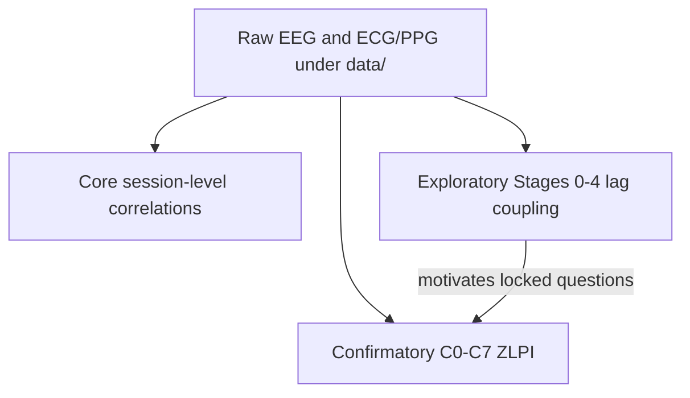
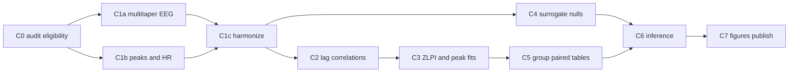

# EEG–cardiac temporal coupling: research findings

This document synthesizes what this repository was built to test, how the analyses are organized, and what the current results support. It covers both the **exploratory** temporal-coupling inventory and the locked **confirmatory** zero-lag reanalysis.

Sources:

- Exploratory Stage 3/4 report: *Cross-Dataset Temporal Coupling Report* (from `temporal_coupling/cross_dataset_temporal_coupling_report.html` / PDF export, last updated 2026-07-10; 8 datasets / 22 dataset–task partitions)
- Confirmatory code: `ppg_eeg/confirmatory/`
- Locked protocol: `zero-lag-reanalysis-repo/master.yaml`
- Confirmatory results: `derivatives/confirmatory_temporal_coupling/` (especially `primary/merged/C6` and `C7/figures`)

Claims below were checked against the locked Python contracts (`duration_contracts.py`, `inference.py`, `nulls.py`, `dataset_roles.py`, `endpoints.py`, `run.py`) and against the merged primary CSVs under `derivatives/confirmatory_temporal_coupling/primary/merged/`. See [§11](#11-code-correspondence-checklist) for the checklist.

---

## 1. Executive summary

**Research question.** Do EEG band-power envelopes and cardiac measures (instantaneous HR / HRV) show a reproducible, lag-resolved physiological coupling signature across independent EEG–ECG/PPG datasets?

**Design.** The work proceeded in two tracks:

1. **Exploratory temporal coupling** (Stages 0–4): descriptive cross-correlation peaks, lag-direction tallies, and event-triggered curves across many datasets and tasks.
2. **Confirmatory zero-lag reanalysis** (C0–C7): a locked protocol centered on the **Zero-Lag Prominence Index (ZLPI)** at 240 s windows, with prespecified primary datasets, paired state contrasts, temporal nulls, and manuscript figures.

**Bottom line (conservative).**

| Claim | Verdict |
|-------|---------|
| Descriptive EEG–cardiac co-fluctuation exists | Supported (exploratory; all 22 Stage 3 partitions had non-zero median peak \|r\|) |
| A single reproducible lag-timing signature across studies | Not established |
| Confirmatory low-demand alpha ZLPI ≠ 0 (pooled) | Not established (directionally positive; CI includes 0) |
| Confirmatory state attenuation of ZLPI | Not established |
| Peak center μ ≈ 0 within ±2 s (TOST) | Not established |
| Prespecified theta > temporal null | Not established |
| Secondary: alpha ZLPI exceeds several autocorrelation-preserving nulls (FDR) | Supported (secondary family) |
| Causal / robust physiological coupling claim | Not supported at confirmatory thresholds |

What is defensible today is **descriptive co-fluctuation**, an **exploratory** pattern of weaker coupling under active tasks, and **secondary** evidence that **alpha** coupling exceeds several temporal nulls. A unified confirmatory near-zero-lag / state-attenuation signature has **not** emerged at the locked thresholds.

---

## 2. Research arc and repository layout

### 2.1 Analysis tracks

The repository contains three related analyses. Raw data stays under `./data`; results under `./derivatives`.

| Track | Goal | Code | Configs | Results |
|-------|------|------|---------|---------|
| Core EEG–PPG correlations | Session-level EEG×PPG feature correlations | `ppg_eeg/core_eeg_ppg/` | `core-eeg-ppg/` | Per-dataset feature + correlation CSVs under `derivatives/` |
| Exploratory temporal coupling | Lag-resolved HR/HRV × EEG envelope coupling (Stages 0–4) | `ppg_eeg/temporal_coupling/` | `exploratory-temporal-coupling/` | `derivatives/run_*_temporal_coupling/`; cross-dataset report under `temporal_coupling/` |
| Confirmatory zero-lag | Locked ZLPI tests, nulls, meta, figures (C0–C7) | `ppg_eeg/confirmatory/` | `zero-lag-reanalysis-repo/` | `derivatives/confirmatory_temporal_coupling/` |

Exploratory and confirmatory trees are intentionally separated so exploratory Stage 0/1b is **not** required for confirmatory runs. Confirmatory never shares an output root with exploratory runs (`master.yaml`: `output_root: ../derivatives/confirmatory_temporal_coupling`).



### 2.2 Top-level directories

| Path | What it is for |
|------|----------------|
| `ppg_eeg/` | Installable Python package: shared I/O helpers, dataset adapters, and the three analysis subpackages |
| `ppg_eeg/core_eeg_ppg/` | Core pipeline: raw → base EEG/PPG features → inter-subject correlations |
| `ppg_eeg/temporal_coupling/` | Exploratory within-subject lag / event-triggered coupling (Stages 0–4) |
| `ppg_eeg/confirmatory/` | Confirmatory zero-lag C0–C7 implementation (this is the locked scientific pipeline) |
| `ppg_eeg/datasets/` | Dataset adapters (HIIT, OpenNeuro IDs, mindfulness) shared across analyses |
| `core-eeg-ppg/` | YAML configs for the core correlation track only |
| `exploratory-temporal-coupling/` | YAML configs for exploratory Stages 0–4 only |
| `zero-lag-reanalysis-repo/` | Locked confirmatory protocol (`master.yaml`) + per-dataset / smoke YAMLs |
| `data/` | Raw recordings (BIDS-style / local raw trees). Not regenerated by analysis code |
| `derivatives/` | All analysis outputs (exploratory run trees + confirmatory trees + misc CSVs) |
| `temporal_coupling/` | Exploratory **documentation and cross-dataset report** (HTML/PDF/JSON), not the Python package |
| `scripts/` | One-off manuscript helpers (e.g. rebuild merged Fig1–3 meta trees, cardiac-control validation) |
| `tests/` | Pytest suite covering adapters, confirmatory stages, figures, and architecture audits |
| `README.md` | Install / run entry points for all three tracks |
| `RESEARCH_FINDINGS.md` | This document: scientific narrative + layout guide |
| `requirements.txt` | Python dependencies |

### 2.3 `ppg_eeg/` package internals

| Path | Role |
|------|------|
| `ppg_eeg/run.py`, `pipeline.py`, `features_core.py`, `eeg.py`, `ppg.py`, … | Shared / legacy helpers used especially by the core track |
| `ppg_eeg/core_eeg_ppg/` | Core Stage 1–2 feature extraction and Spearman/Pearson correlations |
| `ppg_eeg/temporal_coupling/` | Exploratory cardiac detectors, EEG envelopes, cross-correlation, group summary, events |
| `ppg_eeg/confirmatory/` | Full C0–C7 confirmatory stack (see [§9](#9-code-map-confirmatory)) |
| `ppg_eeg/datasets/*.py` | One adapter per cohort (`hiit.py`, `ds003838.py`, `mindfulness.py`, …) |
| `ppg_eeg/bids_physio.py` | BIDS physiological sidecar helpers |

### 2.4 Config directories

| Path | Role |
|------|------|
| `core-eeg-ppg/datasets/`, `example.yaml`, `smoke/`, `fast/` | Core-track run configs |
| `exploratory-temporal-coupling/datasets/`, `smoke/` | Exploratory Stage 0–4 configs |
| `zero-lag-reanalysis-repo/master.yaml` | Frozen confirmatory bands, lags, ZLPI/MWPI/SWPI contracts, dataset path roles, seed |
| `zero-lag-reanalysis-repo/datasets/*.yaml` | Full-cohort confirmatory configs (one YAML per dataset) |
| `zero-lag-reanalysis-repo/smoke/` | Small subsets + HIIT smoke package (`n_surrogates: 20`) |

### 2.5 `derivatives/` output layout

| Path | Role |
|------|------|
| `derivatives/confirmatory_temporal_coupling/primary/` | Primary datasets `ds003690`, `ds003838`, `ds006848` plus `merged/` manuscript pool |
| `derivatives/confirmatory_temporal_coupling/sensitivity/` | `hiit`, `mindfulness`, `ds004582`, `ds004587`, `ds003816` |
| `derivatives/confirmatory_temporal_coupling/smoke/`, `production/`, `audit/`, `review/` | Fast checks, production bundles, protocol audits, figure-window reviews |
| `derivatives/run_*_temporal_coupling/` | Exploratory Stage 0–4 per-dataset run trees |
| `derivatives/correlations_cross_dataset.csv` (and related) | Core-track / cross-dataset correlation artifacts |
| `derivatives/Mindfulness project/` | Ancillary mindfulness materials (not the confirmatory sensitivity tree) |

### 2.6 `temporal_coupling/` (report docs, not code)

This top-level folder is the exploratory report home described in its own README: within-subject lag coupling narrative, HTML report generator, and exported summaries.

| Path | Role |
|------|------|
| `temporal_coupling/README.md` | Plain-language description of exploratory lag / event analyses |
| `temporal_coupling/cross_dataset_temporal_coupling_report.html` | Cross-dataset Stage 3/4 inventory (source of the attached PDF) |
| `temporal_coupling/generate_cross_dataset_report_html.py` | Builds the HTML report from local exploratory derivatives |
| `temporal_coupling/russell_*.json` / `*.md` / `*.pdf` | Report data + narrative exports |

### 2.7 `tests/` and `scripts/`

| Path | Role |
|------|------|
| `tests/test_confirmatory_*.py` | Stage CLI, config locks, correlation, harmonize, inference, outputs |
| `tests/test_dataset_architecture_audit.py` | Enforces dataset-role / meta-pooling architecture rules |
| `tests/test_*temporal*` / `test_cross_correlation.py` | Exploratory coupling regressions |
| `tests/fixtures/` | Small synthetic inputs for unit tests |
| `scripts/run_figure{1,2,3}_manuscript_meta.py` | Rebuild merged manuscript figure trees from primary dataset outputs |
| `scripts/validate_figure3d_cardiac_controls.py` | Cardiac-control panel validation helper |

---

## 3. Exploratory findings (Stage 3 / Stage 4)

The attached *Cross-Dataset Temporal Coupling Report* inventories **22 completed Stage 3** dataset–task partitions across **8 datasets**:

`ds003690`, `ds003816`, `ds003838`, `ds004582`, `ds004587`, `ds006848`, `hiit`, `mindfulness`.

Metrics are medians across usable subjects per task. Cardiac sources include dedicated ECG and embedded PPG/photosensor, depending on dataset.

### 3.1 Coupling presence and magnitude

- All 22 partitions show non-zero median peak \|r\| across HR/HRV × θ/α/β pairs.
- Coupling magnitude spans roughly **0.04–0.48**.
- Largest peaks: **ds003816** (≈0.37–0.48) but on **short** usable cardiac windows (~60–85 s).
- Weakest among long recordings: **ds003838 memory**, **ds006848 verbalwm**.
- Dedicated ECG rest cohorts (e.g. ds003838 rest, ds004582, ds004587) show moderate coupling; PPG cohorts (HIIT, mindfulness) are included but sensor type still matters for interpretation.

### 3.2 Common pattern: task-related attenuation (descriptive)

Within the same cohort, **active tasks are consistently weaker than rest** (memory, verbal WM, Tetris vs rest). This was the most reproducible *descriptive* pattern in the exploratory inventory—not a locked confirmatory test.

### 3.3 Lag direction does not replicate

- Most partitions show **mixed** subject-level peak-lag signs.
- Only **2 of 22** entries had FDR-significant peak-lag direction findings (including ds004587 `hr__beta` and HIIT `post_tetris` `hr__alpha`).
- HRV–alpha lag sign still flips across datasets.

### 3.4 Stage 4 event-triggered curves

Stage 4 was usable in all completed partitions. **HR→EEG** triggered curves were judged more reliable; **EEG→HR** remained exploratory.

### 3.5 Exploratory verdict table (from the report)

| Evidence dimension | Verdict | Summary |
|--------------------|---------|---------|
| Coupling presence | Supported (descriptive) | Non-zero peaks in all 22 Stage 3 runs |
| Coupling magnitude | Partially supported | Moderate in ECG rest; weak under active tasks |
| Lag direction | Not supported | Mixed directions; 2/22 FDR-significant lag findings |
| Cross-study signature | Not yet established | Amplitude partially replicates; timing does not |
| Causal / robust coupling claim | Not supported | Permutation-controlled group evidence required |

**Conservative exploratory conclusion:** a unified physiological coupling signature had not emerged. Defensible claims were descriptive co-fluctuation, systematic weakening during active tasks, and heterogeneous lag timing. That inconclusive timing story is what motivated the confirmatory zero-lag (ZLPI) protocol.

---

## 4. Confirmatory goal and locked hypotheses

The confirmatory package (`ppg_eeg/confirmatory/`) implements a **prespecified** reanalysis: confirm that instantaneous HR and EEG band power show a **lag-resolved near-zero coupling peak (ZLPI)**, that this coupling **attenuates under cognitive demand**, and that temporal-null / cardiac / nuisance controls show the effect is not an obvious artifact.

### 4.1 Locked scientific claims

1. **Near-zero lag coupling.** Low-demand absolute-log10 **D240 ZLPI** differs from 0 (alpha is the confirmatory band for replication forest / Fig1E).
2. **State attenuation.** High cognitive demand **reduces** ZLPI relative to low demand (paired Δ; random-effects meta across primary datasets).
3. **Peak timing.** Low-demand Gaussian peak center **μ ≈ 0** within **±2 s** (one-sample TOST on hierarchical group means).
4. **Specificity / robustness.** Effect survives C4 temporal surrogate nulls and C6 cardiac / nuisance / topography–gamma controls. Shorter windows (D180 ZLPI; D120 MWPI; D60 SWPI) are sensitivity only and **cannot rescue** primary ZLPI.

### 4.2 Primary endpoint definition

On Fisher-z of Pearson *r* lag curves:

- **ZLPI** = \(z(0) − \mathrm{mean}\, z(\text{distant flanks})\), with flanks \(|\tau| \in [20, 60]\) s on the ±60 s grid (1 s step).
- **Local prominence** = \(z(0) − \max z(\text{shoulders})\), shoulders \(|\tau| \in [5, 15]\) s.
- Primary power representation: **`absolute_log10`**.
- Primary duration: **240 s**.
- Bands: θ 4–7, α 8–12, β 13–29, low-γ 30–45 Hz.

Named shorter-window endpoints (not pooled with ZLPI):

| Duration | Endpoint | Lag grid | Role |
|----------|----------|----------|------|
| 240 s | ZLPI | ±60 s | Primary |
| 180 s | ZLPI | ±60 s | Duration sensitivity |
| 120 s | MWPI | ±30 s | Sensitivity only |
| 60 s | SWPI | ±20 s | Sensitivity only (ds003816 descriptive) |

### 4.3 Dataset roles

| Dataset | Path role | Analysis family | Primary meta contrast | Cardiac |
|---------|-----------|-----------------|----------------------|---------|
| ds003690 | primary | paired state-dependent | `passive__gonogo` | ECG |
| ds003838 | primary | paired state-dependent | `rest__memory` | ECG |
| ds006848 | primary | paired state-dependent | `rest__verbalwm` | ECG |
| hiit | sensitivity | exercise-state moderation | — (display only) | PPG |
| mindfulness | sensitivity | internal-attention | — | PPG |
| ds004582 | sensitivity | external single-state generalization | — | ECG |
| ds004587 | sensitivity | external single-state generalization | — | ECG |
| ds003816 | sensitivity | duration (D60 SWPI descriptive only) | — | ECG |

Also in dataset-level display (not primary meta): ds003690 `passive__simplert` (graded effort).

**Important:** path role (primary vs sensitivity folder) must not be conflated with scientific family. Only the three primary paired contrasts enter the manuscript RE meta.

---

## 5. Confirmatory pipeline (C0–C7)

**C0–C7 are pipeline stages, not scientific contrasts.** Contrasts are labels such as `rest__memory` or `passive__gonogo`.



| Stage | What it does | Key outputs |
|-------|--------------|-------------|
| **C0** | Data audit, protocol audit, pairing, duration eligibility | `eligibility_*.csv`, `protocol_audit.csv`, `paired_subject_sets.json` |
| **C1a** | DPSS multitaper band power (2 s window, 1 s step, NW=3, 5 tapers) | `features_multitaper_power.csv` |
| **C1b** | Cardiac peak detection + instantaneous HR | peaks / IHR features + QC |
| **C1c** | Align HR + EEG onto nested midpoints (D60/120/180/240) | `features_confirmatory_aligned_D*.csv` |
| **C2** | Signed lag correlations (HR × EEG) on 1 Hz common support | `confirmatory_cross_correlation_curves_D*.csv` |
| **C3** | Endpoints (ZLPI/MWPI/SWPI) + Option-C Gaussian peak fits | endpoint + `peak_fit_*.csv` |
| **C4** | Surrogate nulls (production **500** surrogates) | `null_summary.csv`, `null_subject_results.csv` |
| **C5** | Subject-level metrics + paired high−low contrasts | `subject_level_metrics.csv`, `paired_contrasts.csv` |
| **C6** | MixedLM / RE meta / TOST / BH-FDR / cardiac–nuisance–topo panels | `meta_analysis_results.csv`, multiplicity, panel CSVs |
| **C7** | Publish flatten + manuscript figures + captions | `C7/figures/`, `publish/`, manifests |

C4 null types: `circular_shift`, `phase_randomization`, `block_shuffle`, `cross_subject_mismatch`, `ar1_innovations`. Root seed: **20260713**.

Soft prerequisites in `run.py` (`STAGE_REQUIRES`): C1c needs C1a+C1b; C2 needs C1c; C3 needs C2; C4 needs C1c; C5 needs C3; C6 needs C5; C7 needs C2+C5. Manuscript figures still consume C4/C6 tables when present under the dataset (or merged) tree.

Entry point:

```bash
python -m ppg_eeg.confirmatory \
  --config zero-lag-reanalysis-repo/datasets/<dataset>.yaml \
  --stage all
```

Batch modes: `--mode preflight|smoke|primary|sensitivity`. Post-run QC (read-only): `--mode qc-report`.

---

## 6. Confirmatory results (primary / merged)

Manuscript-facing numbers live under:

`derivatives/confirmatory_temporal_coupling/primary/merged/`

Primary datasets: **ds003690**, **ds003838**, **ds006848**. Paired meta sample: **n = 70 + 47 + 21 = 138** participants.

### 6.1 Eligibility (D240, before pairing QC)

| Dataset | Eligible obs / participants @ D240 | Notes |
|---------|--------------------------------------|-------|
| ds003690 | 375 / 75 | All durations eligible |
| ds003838 | 120 / 65 | +10 ineligible (`insufficient_raw_duration`) |
| ds006848 | 44 / 22 | +8 ineligible (`missing_paired_state`) each duration |

### 6.2 Figure 1 — lag-resolved zero-lag structure / alpha replication

Canonical figure: `primary/merged/C7/figures/figure1_lag_resolved_zero_lag.*`

**Low-demand alpha ZLPI replication (Fig1E)** — from `C6/low_demand_alpha_replication_*.csv`:

| Dataset | Mean ZLPI | 95% CI | n | p |
|---------|-----------|--------|---|---|
| ds003690 | +0.0208 | [−0.020, 0.061] | 70 | 0.31 |
| ds003838 | +0.0165 | [−0.031, 0.064] | 47 | 0.49 |
| ds006848 | +0.0245 | [−0.069, 0.118] | 21 | 0.59 |
| **Pooled (Paule–Mandel RE)** | **+0.0195** | **[−0.009, 0.048]** | 3 datasets | **0.180** |

Point estimates are consistently positive; the **pooled CI includes zero**. Leave-one-out pooled estimates stay ~0.018–0.021 with CIs that still include 0.

**Peak center TOST (±2 s, Fig1F):** for D240 absolute_log10 low-demand, **`equivalent=False`** for all primary dataset × band cells checked (e.g. ds003690 alpha mean μ ≈ −0.21 s, TOST p ≈ 0.19). Caption language: *μ equivalence is not established*.

### 6.3 Figure 2 — state attenuation

Canonical figure: `primary/merged/C7/figures/figure2_state_attenuation_replication.*`

**Pooled high−low ΔZLPI (Fig2C / `meta_analysis_results.csv`)**:

| Band | Pooled Δ | 95% CI | p | I² |
|------|----------|--------|---|-----|
| alpha | −0.00786 | [−0.044, 0.028] | **0.671** | 0 |
| beta | +0.00337 | [−0.033, 0.040] | 0.858 | 0 |
| low_gamma | −0.0129 | [−0.047, 0.021] | 0.463 | 0 |
| theta | −0.00255 | [−0.031, 0.026] | 0.861 | 0 |

Per-dataset alpha Δ entering meta: ds003690 −0.013 (p=0.60, n=70); ds003838 −0.0037 (p=0.91, n=47); ds006848 +0.0039 (p=0.94, n=21).

**Primary multiplicity family:** **0 / 56** BH-FDR rejections (`multiplicity_results.csv`).

State attenuation of ZLPI is **not established** at confirmatory thresholds. (Exploratory descriptive attenuation of peak \|r\| under active tasks is a separate, weaker claim.)

### 6.4 Figure 3 — temporal specificity and robustness

Canonical figure: `primary/merged/C7/figures/figure3_temporal_artifact_specificity.*`

**Prespecified theta circular-shift null (Panel A primary slice):**

- mean Δ (observed − null) = **+0.0069**
- 95% CI [−0.0055, 0.019]
- p_two = **0.272**, Cohen’s dz ≈ 0.07
- n = 245 analysis units / 170 biological participants / 533 condition estimates
- Interpretation recorded in source data: *directionally positive but inconclusive*

**Secondary pooled null family (FDR, `figure3_secondary_nulls_fdr.csv`)** — notable alpha exceedances:

| Slice | mean Δ | p_two | q | reject_fdr |
|-------|---------|-------|---|------------|
| alpha × circular_shift | 0.0178 | 0.0127 | 0.045 | **True** |
| alpha × phase_randomization | 0.0193 | 0.0063 | 0.031 | **True** |
| alpha × cross_subject_mismatch | 0.0191 | 0.0057 | 0.031 | **True** |
| alpha × ar1_innovations | 0.0132 | 0.0067 | 0.031 | **True** |
| alpha × block_shuffle | 0.0142 | 0.039 | 0.075 | False |
| theta × circular_shift (primary) | 0.0069 | 0.272 | — | False |

So: **alpha** observed ZLPI exceeds several temporal nulls after FDR in the secondary family; the **theta** confirmatory null claim does **not**.

Caption-level caution also applies to pairing specificity (inconclusive), cardiac controls (many not-computable / composition-changed), nuisance adjustment (does not establish a positive effect), and low-γ topography (artifact-indeterminate).

### 6.5 Sensitivity cohorts (outside primary meta)

Full C0–C7 trees exist under `derivatives/confirmatory_temporal_coupling/sensitivity/` for hiit, mindfulness, ds004582, ds004587, ds003816. They are role-gated out of primary forest/meta integrity checks.

| Dataset | Role of results |
|---------|-----------------|
| **hiit** | Exercise-state Rest↔Tetris contrasts; primary-flagged ΔZLPI NS (p > 0.16); `enters_meta=False` |
| **mindfulness** | `step1__step3` alpha Δ = −0.0467, **nominal p = 0.027**, n=29 (not meta; other bands/contrasts largely NS) |
| **ds003816** | Manuscript design: **D60 only** (SWPI descriptive); longer durations `excluded_by_manuscript_design` |
| **ds004582 / ds004587** | External single-state generalization; empty primary meta. Treat ds004587 with care if `STALE_INVALIDATED.txt` is present |

---

## 7. What is and is not established

### Supported (with stated caveats)

- Full exploratory Stage 3/4 inventory across 8 datasets / 22 partitions.
- Full confirmatory C0–C7 pipeline for 3 primary + 5 sensitivity datasets, with merged manuscript figures and source-data CSVs.
- Descriptive EEG–cardiac co-fluctuation in exploratory peaks.
- Exploratory within-cohort weakening of coupling under active tasks.
- Consistently **positive** low-demand alpha ZLPI point estimates across primary datasets (not significant when pooled).
- **Secondary** FDR evidence that **alpha** ZLPI exceeds circular-shift, phase-randomization, cross-subject-mismatch, and AR(1)-innovations nulls.

### Not established at confirmatory thresholds

- Pooled low-demand alpha ZLPI ≠ 0.
- State-dependent attenuation of ZLPI (RE meta and within-band model contrasts).
- Peak-center equivalence to zero lag (±2 s TOST).
- Prespecified theta exceedance of temporal nulls.
- Primary BH-FDR family for meta / local-prominence tests (0/56 rejects).
- A single cross-study lag-timing signature.
- A causal physiological coupling claim.

### How the two tracks relate

Exploratory work showed **presence** of coupling and **suggestive** task attenuation, but **failed** to lock timing. Confirmatory work asked a sharper near-zero-lag / attenuation / null-specificity question with locked estimands—and largely returned **null / inconclusive** primary answers, with the main positive signal in a **secondary alpha-null** family. That is a coherent research arc, not a contradiction: descriptive co-fluctuation ≠ confirmatory ZLPI claim.

---

## 8. Where artifacts live / how to reproduce

### Confirmatory output tree

```text
derivatives/confirmatory_temporal_coupling/
├── primary/
│   ├── ds003690|ds003838|ds006848/   # per-dataset C0–C7
│   └── merged/                       # manuscript pool + Fig1–3
│       ├── C5/, C6/, C7/figures/, …
│       └── manuscript_meta_summary.json
├── sensitivity/
│   ├── ds003816|ds004582|ds004587|hiit|mindfulness/
│   └── …/C0–C7/
├── smoke/                            # fast n_surrogates=20
├── production/, audit/, review/      # ops / audits
```

Key manuscript paths:

- Figures: `primary/merged/C7/figures/figure{1,2,3}_*.{png,pdf,svg}`
- Captions: `primary/merged/C7/figures/figure{1,2,3}_caption.txt`
- Source data: `primary/merged/C7/figures/source_data/`
- Inference tables: `primary/merged/C6/*.csv`

### Run confirmatory (repo root)

```bash
# Single dataset, full pipeline
.venv/bin/python -m ppg_eeg.confirmatory \
  --config zero-lag-reanalysis-repo/datasets/ds003838.yaml \
  --stage all

# Production batch roles
.venv/bin/python -m ppg_eeg.confirmatory --mode primary
.venv/bin/python -m ppg_eeg.confirmatory --mode sensitivity

# Read-only QC after stages exist
.venv/bin/python -m ppg_eeg.confirmatory \
  --mode qc-report \
  --config zero-lag-reanalysis-repo/datasets/hiit.yaml
```

Protocol authority: `zero-lag-reanalysis-repo/master.yaml` and `zero-lag-reanalysis-repo/README.md`.  
Exploratory entry: `python -m ppg_eeg.temporal_coupling` with configs under `exploratory-temporal-coupling/`.

---

## 9. Code map (confirmatory)

| Module | Role |
|--------|------|
| `run.py` / `__main__.py` | CLI stage dispatcher (C0–C7, production modes) |
| `config.py` | Strict YAML schema (`master.yaml`, `datasets/*.yaml`) |
| `dataset_roles.py` | Scientific profiles; primary-meta vs display gates |
| `protocol_audit.py` | C0 contrasts, pairing, duration eligibility |
| `multitaper_power.py` | C1a DPSS multitaper band power |
| `peak_detection.py` / `instant_hr.py` | C1b peaks + instantaneous HR |
| `harmonize.py` | C1c nested-duration alignment |
| `correlation.py` | C2 lag correlations |
| `endpoints.py` / `peak_model.py` | C3 ZLPI/MWPI/SWPI + Gaussian peaks |
| `nulls.py` | C4 surrogate null battery |
| `group_tables.py` | C5 subject metrics + paired Δ |
| `inference.py` | C6 MixedLM, RE meta, TOST, BH-FDR |
| `artifact_controls.py` / `panel_d_*` / `panel_e_*` / `panel_f_*` | Robustness panels |
| `null_delta_inference.py` / `paired_delta_inference.py` | Fig3 / Fig2 cluster-aware inference |
| `figures.py` + `figure1_panels.py` / `figure2_panels.py` | C7 manuscript figures |
| `manuscript_meta.py` | Merge primary datasets → `primary/merged/` |
| `qc_report.py` | Read-only post-run QC (`--mode qc-report`) |
| `ds003816_descriptive_figures.py` | D60 SWPI descriptive QC (sensitivity) |

Shared dataset adapters live in `ppg_eeg/datasets/`. Core feature extraction used by other tracks lives in `ppg_eeg/core_eeg_ppg/`.

---

## 10. Practical takeaway

This repo implements a careful progression from **broad descriptive coupling** to a **locked confirmatory ZLPI protocol** with eligibility audits, nested duration contracts, surrogate nulls, and role-gated meta-analysis.

The scientific answer, as currently estimated:

1. EEG and cardiac signals **co-fluctuate** in many datasets (exploratory).
2. A **reproducible near-zero-lag / state-attenuation confirmatory signature** has **not** been established on the primary D240 absolute-log10 ZLPI estimands.
3. The strongest confirmatory-positive signal in the locked outputs is **secondary**: alpha ZLPI exceeding several temporal nulls after FDR—useful for discussion, not a substitute for the failed primary attenuation / μ-equivalence / theta-null claims.

Interpretation should stay aligned with the manuscript figure captions under `primary/merged/C7/figures/`, which already encode this conservative language.

---

## 11. Code correspondence checklist

Verified against the codebase and `primary/merged` outputs (spot-check date of this document’s generation). Use this as an audit trail for the claims above.

| Claim in this document | Where it lives in code / outputs | Match? |
|------------------------|----------------------------------|--------|
| C0–C7 stage letters are pipeline stages | `ppg_eeg/confirmatory/run.py` `STAGE_ORDER` | Yes |
| Primary duration 240 s; μ TOST ±2 s | `duration_contracts.py` `EXPECTED_PRIMARY_DURATION_S`, `EXPECTED_PEAK_CENTER_EQUIVALENCE_S`; enforced in `config.py` | Yes |
| ZLPI = \(z_0 - \mathrm{mean}\,z(\text{flanks})\); prominence vs shoulders | `endpoints.py` `evaluate_endpoint_curve` (`endpoint_index = z0 - combined_z`) | Yes |
| D240/D180 ZLPI; D120 MWPI; D60 SWPI; MWPI/SWPI never pool with ZLPI | `duration_contracts.py` docstring + contracts; `master.yaml` `endpoints.by_duration` | Yes |
| Primary meta contrasts: `rest__memory`, `rest__verbalwm`, `passive__gonogo` | `inference.py` `PRIMARY_META_CONTRASTS` | Yes |
| `passive__simplert` in FDR/display only, not primary meta | `inference.py` comments + `PRIMARY_STATE_CONTRASTS` | Yes |
| Sensitivity / external / duration cohorts excluded from primary meta | `inference.py` `META_EXCLUDED_DATASETS`; `dataset_roles.py` profiles | Yes |
| Path role vs analysis family must not be conflated | `dataset_roles.py` module docstring | Yes |
| Null types + 500 surrogates; circular shift ≥60 s; block 30 s | `nulls.py` `NULL_TYPES`, `DEFAULT_N_SURROGATES`, `MIN_CIRCULAR_SHIFT_S`, `BLOCK_LENGTH_S` | Yes |
| Primary power representation `absolute_log10` | `inference.py` `PRIMARY_POWER_REPRESENTATION` | Yes |
| BH-FDR α = 0.05 | `inference.py` `FDR_ALPHA` | Yes |
| Root seed 20260713; confirmatory output root | `zero-lag-reanalysis-repo/master.yaml` | Yes |
| Pooled alpha ΔZLPI ≈ −0.0079, p ≈ 0.67 | `primary/merged/C6/meta_analysis_results.csv` | Yes |
| Pooled low-demand alpha ZLPI ≈ +0.0195, p ≈ 0.18 | `primary/merged/C6/low_demand_alpha_replication_meta.csv` | Yes |
| Meta n_pairs 70 / 47 / 21 | `primary/merged/C6/dataset_effects.csv` (`enters_meta=True`) | Yes |
| 0/56 primary FDR rejects | `primary/merged/C6/multiplicity_results.csv` | Yes |
| Peak μ `equivalent=False` on D240 absolute_log10 low-demand | `primary/merged/C6/peak_center_equivalence.csv` | Yes |
| Theta circular-shift Δ ≈ 0.0069, p ≈ 0.272 | `C7/figures/source_data/figure3_panel_a_inference.csv` | Yes |
| Secondary alpha null FDR rejects (circular/phase/cross/AR1) | `C7/figures/source_data/figure3_secondary_nulls_fdr.csv` | Yes |
| Mindfulness `step1__step3` alpha nominal p ≈ 0.027 | `sensitivity/mindfulness/C6/dataset_effects.csv` | Yes |
| Exploratory Stage 3/4 inventory (22 partitions) | `temporal_coupling/cross_dataset_temporal_coupling_report.html` | Yes (report text; not re-derived here) |
| Confirmatory package docstring / config separation | `ppg_eeg/confirmatory/__init__.py` | Yes |

**Nuance worth knowing:** `STAGE_REQUIRES["C7"]` only soft-requires `C2` and `C5` (not C4/C6). In practice manuscript figures read C6/C4 products from the same output tree; do not interpret the soft prerequisite list as “C6 is unused.”

**Not re-verified from raw data in this pass:** exploratory median \|r\| ranges and lag-direction tallies are taken from the existing cross-dataset report export, not recomputed from every `derivatives/run_*` tree.
