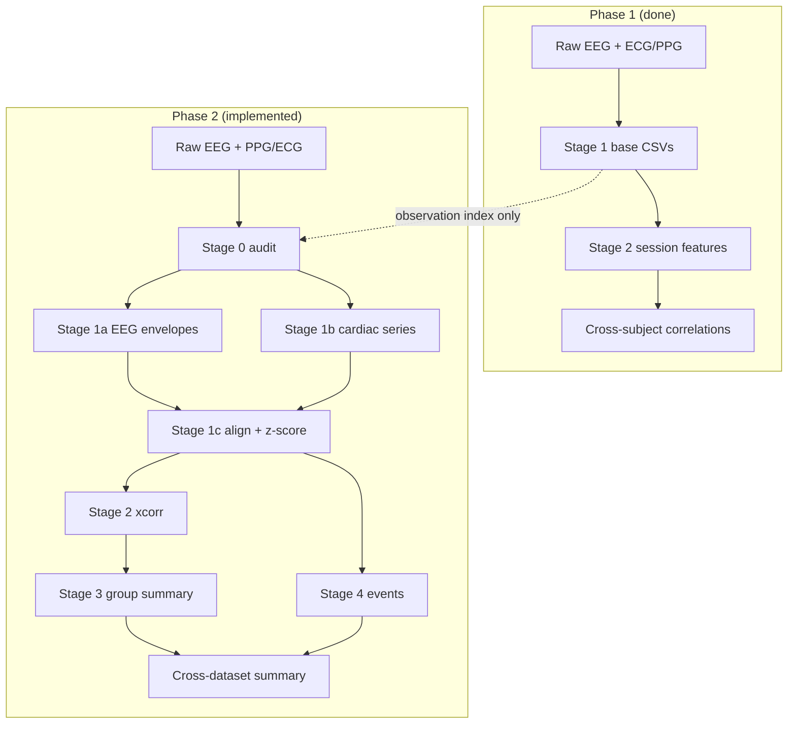

# Temporal EEG–Cardiac Coupling (Within-Subject Analysis)

This folder is the home for the **second analysis phase** of the EEG–PPG project. The first phase asked: *“Do people with higher theta also tend to have higher heart rate?”* (between subjects). This phase asks: *“When **one person’s** heart rate goes up, does their brain activity change a few seconds before or after?”* (within subject, over time).

---

## What Are We Doing?

Imagine you are watching a movie of **one person’s** brain and heart at the same time.

- The **brain** hums in different “speeds” (slow theta, medium alpha, fast beta). We measure how loud each hum is, moment by moment.
- The **heart** beats faster or slower. We measure heart rate (HR) and how “wiggly” the beat timing is (HRV: RMSSD, SDNN).

**The big question:** When the heart does something interesting, does the brain already know? Or does the brain change first and the heart follows?

We answer that in two ways:

1. **Lagged cross-correlation** — slide two timelines past each other and ask: “At what time offset do they match best?”
2. **Event-triggered averages** — pick big heart-rate jumps (or big brain bursts) and average what happened just before and after.

---

## Simple Analogy: Two Friends Walking

Think of EEG and heart rate as two friends walking side by side, each with a pedometer that beeps every second.

| What we measure | Friend A (Brain) | Friend B (Heart) |
|-----------------|------------------|------------------|
| Signal | How loud theta/alpha/beta is | HR, RMSSD, SDNN |
| Question | Who starts walking faster first? | |

- **Negative lag** → Friend A (brain) moved first → *brain may drive the heart*
- **Positive lag** → Friend B (heart) moved first → *heart may drive the brain*
- **Lag near zero** → they stepped together → *shared cause or tight coupling*

We do this **separately for each person**, then combine results at the group level.

**Interpretation guardrails:** These are descriptive timing patterns, not causal claims. Treat group permutation support as the stricter evidence layer; selected peak-r significance alone is exploratory.

---

## Implementation Status

| Stage | Description | Status |
|-------|-------------|--------|
| **0** | Data audit (preflight) | ✅ Done |
| **1a** | EEG Hilbert envelopes + QC plots | ✅ Done |
| **1b** | Cardiac HR/HRV time series + peak-detection QC | ✅ Done |
| **1c** | Merge, resample, z-score → aligned CSV | ✅ Done |
| **2** | Lagged cross-correlation (per observation) | ✅ Done |
| **3** | Group cross-correlation summary | ✅ Done |
| **4** | Event-triggered analysis | ✅ Done |
| **Cross-dataset** | Replication summary + consistency tables | ⏳ In progress |
| **Config recommend** | Data-driven `min_overlap_s` + cardiac windows | ✅ Done |

### Dataset coverage

| Dataset | Config | Tasks / conditions | Cardiac source | Pipeline status |
|---------|--------|-------------------|----------------|-----------------|
| **ds003838** | `config.validation.ds003838.temporal_coupling.yaml` | **rest only** | Separate ECG (BIDS `.set`) | ✅ Full cohort (65 subjects, Stages 0–4) |
| **ds003838** | `exploratory-temporal-coupling/datasets/ds003838.yaml` | **rest + memory** | Separate ECG | ⏳ Config ready; run pending |
| **ds006848** | `exploratory-temporal-coupling/datasets/ds006848.yaml` | **rest, verbalwm** | Embedded PPG (BrainVision) | ⏳ Stage 0 done (52/52 usable) |
| **HIIT** | `exploratory-temporal-coupling/datasets/hiit.yaml` | **8 conditions** (PS/PH × PRE/POST × REST/TETRIS) | Embedded PPG (BrainVision) | ⏳ Config ready; run pending |
| **ds003690** | `exploratory-temporal-coupling/datasets/ds003690.yaml` | gonogo, passive, simplert | Embedded EKG (EEGLAB) | ⏳ In progress |
| **ds003816** | `exploratory-temporal-coupling/datasets/ds003816.yaml` | 7 tasks × sessions | Embedded ECG (BrainVision) | ⏳ In progress |
| **ds003838** | `exploratory-temporal-coupling/smoke/ds003838.yaml` | rest (3 subjects) | Separate ECG | ✅ Smoke / debug |

**Important:** Analyze each task or condition **separately** — never concatenate different tasks or HIIT states in one group summary.

Stages 2–4 read `features_temporal_aligned.csv` only — no raw EEG/cardiac reload needed to rerun analysis.

---

## Pipeline Stages (Plain English)

### Stage 0 — Data audit (preflight) ✅

Check each observation has enough continuous EEG + cardiac overlap before processing.

**Output:** `group/data_audit.csv` — durations, sfreq, `usable`, `recommended_max_lag_s`, plus `condition`, `eeg_format`, `ppg_source` for multi-dataset runs.

Stage 0 uses dataset adapters (`build_observations`) so the same code path supports BIDS EEGLAB (ds003838), BrainVision (ds006848, HIIT), and embedded PPG.

---

### Stage 1 — Temporal feature extraction (three CSVs) ✅

**Goal:** Turn raw signals into aligned, comparable time series.

| Step | What | Output file |
|------|------|-------------|
| 1a | Raw EEG → Hilbert band envelopes (theta/alpha/beta) | `features_temporal_eeg_envelope.csv` |
| 1b | Raw ECG/PPG → HR + sliding-window RMSSD/SDNN | `features_temporal_cardiac.csv` |
| 1c | Merge, resample, z-score within observation | `features_temporal_aligned.csv` |

Per-observation outputs live under `{out_root}/{dataset_id}/{observation_id}/` (not per subject only — required for HIIT multi-condition subjects).

#### Stage 1a QC

Per observation: envelope debug plots, timeseries, optional PSD. Group: `group/eeg_envelope_qc.csv`.

Envelopes are downsampled before write (`envelope_output_fs_hz: 10`) to keep CSVs small.

**ROIs (all run configs):**

| Band | Channels |
|------|----------|
| Theta | Fz, F1, F2, FCz, FC1, FC2, Cz |
| Alpha | Pz, P3, P4, POz, PO3, PO4, Oz, O1, O2 |
| Beta | Fz, F1, F2, FCz, FC1, FC2, Cz, C3, C4 |

Missing requested channels are skipped; envelopes average over available channels. `eeg_envelope_qc.csv` reports `*_roi_channels_used` and `missing_roi_channel` warnings.

#### Stage 1b QC

Per observation: channel inventory, peak-detector comparison, detected peaks, debug plots. Group: `group/cardiac_qc.csv`.

Auto mode selects channel, detector, and polarity by quality score.

For **EKG** channels (ds003690), set `signal_type: ecg` explicitly so `ecg_rpeak` runs (channel-name inference alone may label `unknown`).

**Cardiac window timing:** the first HR/HRV time point appears at `max(hr_window_s, mean_rr_window_s, hrv_window_s) / 2` seconds. On short recordings, large `hrv_window_s` can delay cardiac series and cause Stage 1c `no_temporal_overlap` even when `hr_window_s` is small.

**`features_temporal_aligned.csv` columns (z-scored):**

`dataset_id | subject_id | task | observation_id | time_s | hr | rmssd | sdnn | mean_rr | theta_env | alpha_env | beta_env | hr_z | rmssd_z | sdnn_z | mean_rr_z | theta_env_z | alpha_env_z | beta_env_z`

Group: `group/alignment_qc.csv` — check `usable_for_xcorr`, `aligned_duration_s`, `missing_percent_hr`, and `warning` (e.g. `upstream_not_usable_for_hr`, `short_aligned_duration`).

---

### Tuning config from your data ✅

After Stage **1b** and **1c**, get suggested `min_overlap_s` and cardiac window values from QC outputs:

```bash
$PY -m ppg_eeg.temporal_coupling \
  --config exploratory-temporal-coupling/datasets/ds003816.yaml \
  --recommend-config-values
```

The tool reads `group/alignment_qc.csv` and per-observation envelope/cardiac CSVs, then prints a YAML snippet. Apply changes to your config and rerun **1b + 1c** if cardiac windows changed (or **1c only** if only `min_overlap_s` changed).

**Rule of thumb for `min_overlap_s`:** pick the smallest threshold that keeps most rows usable (often ~20 s for ds003816 short tasks vs default 30–120 s for long rest recordings).

---

### Stage 2 — Lagged cross-correlation (per observation) ✅

**Goal:** For each of the **9 EEG–cardiac pairs**, find the best time alignment.

| Cardiac | EEG bands |
|---------|-----------|
| HR | theta, alpha, beta |
| RMSSD | theta, alpha, beta |
| SDNN | theta, alpha, beta |

For each pair:
1. Compute correlation at lags up to `lag_max_s` (capped per observation by `overlap_duration_s / 3`).
2. **Raw peak** = lag with strongest correlation per `peak_selection`: `positive_only` (default) or `abs_peak` (|r| max, allows negative peaks).
3. Interior/preferred peaks are QC-only when `edge_margin_s > 0`.
4. Permutation null (`p_perm`, default `n_permutations: 100` in run configs).
5. Write per-observation peaks/curves and group aggregates.

**Lag sign cheat sheet:**

| Peak lag | Meaning |
|----------|---------|
| Negative | EEG changed *before* HR → brain → heart |
| Positive | HR changed *before* EEG → heart → brain |
| ~0 | Simultaneous or common driver |

**Per-observation outputs:** `cross_correlation_peaks.csv`, `cross_correlation_curves.csv`, QC plots.

**Group outputs:** `group/cross_correlation_peaks.csv`, `group/cross_correlation_curves.csv`, `group/cross_correlation_qc_summary.csv`, `cross_correlation_peak_validation.csv`, QC plots.

---

### Stage 3 — Group summary ✅

**Goal:** See if patterns repeat across people within a task/condition.

Collect one row per subject per pair, then summarize at the group level (median/mean, FDR, group permutation).

**Three inference layers** (report all; treat group perm as strictest):

1. Selected peak signed-r vs zero (`sig_peak_signed_r_fdr`) — exploratory if not permutation-supported
2. Group-level permutation-controlled peak strength (`sig_group_perm_fdr`) — stricter evidence
3. Peak-lag direction vs zero (`sig_peak_lag_fdr`)

**Group outputs:**
- `peak_correlation_summary.csv`
- `group_cross_correlation_summary.csv`
- `mean_cross_correlation_curves.csv`
- `stage3_interpretation_notes.txt`
- Mean ± SEM grid, heatmaps, peak lag/r distribution plots

**ds003838 rest reference (65 subjects):** all 9 pairs selected-peak-r significant; **rmssd × beta** and **sdnn × beta** survive group permutation (q ≈ 0.045). Lag directions are mixed across subjects.

---

### Stage 4 — Event-triggered analysis ✅

**Goal:** Zoom in on dramatic moments with subject-balanced group averages.

**Averaging method:** `subject_mean_then_group_mean` (`subject_balanced_average: true`)

1. Average accepted events **within each subject** first.
2. Average **one trajectory per subject** across subjects.

#### Heart-led events (HR → EEG)

- HR increase / HR decrease events (top/bottom tail of ΔHR z-score).
- Extract ±`epoch_pre_s` / ±`epoch_post_s` epochs of `theta_env_z`, `alpha_env_z`, `beta_env_z`.

#### Brain-led events (EEG → cardiac)

| Event | Default detection |
|-------|-------------------|
| Theta burst | top 10% `theta_env_z` |
| Alpha suppression | bottom 10% `alpha_env_z` |
| Beta burst | top 10% `beta_env_z` |

Extract `hr_z`, `rmssd_z`, `sdnn_z` around each accepted event.

#### Usability thresholds

| Rule | Default |
|------|---------|
| Minimum total events | 10 |
| Minimum contributing subjects | 4 |

Event types below threshold → `usable_for_group_plot: false` (exploratory).

**Group outputs:**
- `event_counts.csv`, `event_list.csv`, `event_qc.csv`
- `event_triggered_hr_to_eeg.csv`, `event_triggered_eeg_to_hr.csv`
- `event_triggered_hr_to_eeg.png`, `event_triggered_eeg_to_hr.png`
- `stage4_interpretation_notes.txt`

Treat event-triggered results as **descriptive support**, not causal evidence.

---

## How This Fits the Existing Repo



| Phase | Question | Unit of analysis |
|-------|----------|------------------|
| Phase 1 | Do high-theta *people* have high HR? | One number per subject |
| Phase 2 | When HR *changes*, does theta change too — and when? | Every second, per observation |

---

## Directory Layout

```
temporal_coupling/          ← you are here (docs)
  README.md
  IMPLEMENTATION_PLAN.md

exploratory-temporal-coupling/smoke/ds003838.yaml       ← 3-subject smoke (rest)
config.validation.ds003838.temporal_coupling.yaml  ← ds003838 rest only (reference)
exploratory-temporal-coupling/datasets/ds003838.yaml         ← ds003838 rest + memory
exploratory-temporal-coupling/datasets/ds006848.yaml         ← ds006848 rest + verbalwm
exploratory-temporal-coupling/datasets/hiit.yaml             ← HIIT 8 conditions

ppg_eeg/temporal_coupling/
  __main__.py               ← CLI entry
  config.py
  run.py
  paths.py                  ← observation- and partition-aware output paths
  data_audit.py             ← Stage 0
  eeg_envelope.py           ← Stage 1a
  cardiac_common.py
  cardiac_detectors.py
  cardiac_timeseries.py     ← Stage 1b
  resample.py               ← Stage 1c
  cross_correlation.py      ← Stage 2
  group_summary.py          ← Stage 3
  events.py                 ← Stage 4
  recommend.py              ← data-driven config suggestions

derivatives/validation_ds003838_temporal_coupling/  ← ds003838 rest reference (65 subjects)
derivatives/run_ds003838_temporal_coupling/        ← ds003838 all tasks (pending)
derivatives/run_ds006848_temporal_coupling/        ← ds006848 (Stage 0 done)
derivatives/run_hiit_temporal_coupling/            ← HIIT (pending)
derivatives/run_ds003690_temporal_coupling/        ← ds003690 (EKG embedded)
derivatives/run_ds003816_temporal_coupling/        ← ds003816 (ECG embedded, short tasks)
```

Per observation:

```
{out_root}/{dataset_id}/{observation_id}/
  features_temporal_eeg_envelope.csv
  features_temporal_cardiac.csv
  features_temporal_aligned.csv
  cross_correlation_peaks.csv
  cross_correlation_curves.csv
  ...
```

Group (per dataset run):

```
{out_root}/{dataset_id}/group/
  data_audit.csv
  eeg_envelope_qc.csv
  cardiac_qc.csv
  alignment_qc.csv
  cross_correlation_peaks.csv
  peak_correlation_summary.csv
  event_qc.csv
  ...
```

---

## Running

Use the project venv and run **one stage at a time**, inspecting QC before continuing.

```bash
cd /path/to/ppg-eeg
PY=".venv/bin/python"

# Example: ds003838 all tasks — Stage 0
$PY -m ppg_eeg.temporal_coupling \
  --config exploratory-temporal-coupling/datasets/ds003838.yaml \
  --stage 0

# Stage 1 (1a + 1b + 1c)
$PY -m ppg_eeg.temporal_coupling \
  --config exploratory-temporal-coupling/datasets/ds003838.yaml \
  --stage 1

# Optional: suggest min_overlap_s and cardiac windows from QC (needs 1b+1c done)
$PY -m ppg_eeg.temporal_coupling \
  --config exploratory-temporal-coupling/datasets/ds003816.yaml \
  --recommend-config-values

# Stages 2–4 (read aligned CSVs only)
$PY -m ppg_eeg.temporal_coupling \
  --config exploratory-temporal-coupling/datasets/ds003838.yaml \
  --stage 2

$PY -m ppg_eeg.temporal_coupling \
  --config exploratory-temporal-coupling/datasets/ds003838.yaml \
  --stage 3

$PY -m ppg_eeg.temporal_coupling \
  --config exploratory-temporal-coupling/datasets/ds003838.yaml \
  --stage 4
```

Swap the config for ds006848 or HIIT:

```bash
$PY -m ppg_eeg.temporal_coupling \
  --config exploratory-temporal-coupling/datasets/ds006848.yaml \
  --stage 0

$PY -m ppg_eeg.temporal_coupling \
  --config exploratory-temporal-coupling/datasets/hiit.yaml \
  --stage 0
```

**Valid CLI flags:** `--config` (required), `--stage` (required unless recommending), `--recommend-config-values`

**Valid `--stage` values:** `0`, `1`, `1a`, `1b`, `1c`, `2`, `3`, `4`, `all`

Stage `1` runs 1a + 1b + 1c together. Prefer staged runs (`0` → inspect → `1` → …) for full cohorts.

---

## Smoke Test Results (ds003838 rest, 3 subjects)

| Subject | EEG usable | Cardiac channel | Detector | Median HR | Usable HR/HRV |
|---------|------------|-----------------|----------|-----------|---------------|
| sub-033 | yes | ECG (inverted) | ecg_rpeak | 79 bpm | yes / yes |
| sub-036 | yes | ECG (normal) | ecg_rpeak | 78 bpm | yes / yes |
| sub-038 | yes | ECG (normal) | ecg_rpeak | 71 bpm | yes / yes |

---

## Key Deliverables

### Per observation (Stages 0–2)
- [x] `features_temporal_aligned.csv`
- [x] `cross_correlation_peaks.csv`, `cross_correlation_curves.csv`
- [x] Stage 1 QC plots + group QC CSVs

### Per dataset / task / condition (`group/`)
- [x] `peak_correlation_summary.csv`, mean curves, Stage 3–4 plots
- [x] Event QC and event-triggered CSVs
- [ ] `subject_consistency_summary.csv` (cross-dataset replication)
- [ ] Partitioned group outputs when multiple tasks/conditions in one config

### Cross-dataset (planned)
- [ ] `cross_dataset_temporal_coupling_summary.csv`
- [ ] `cross_dataset_event_qc_summary.csv`
- [ ] Cross-dataset heatmaps (peak strength, group perm, lag, edge peaks, consistency)

See [IMPLEMENTATION_PLAN.md](./IMPLEMENTATION_PLAN.md) for module breakdown, parameters, QC schemas, and build order.
