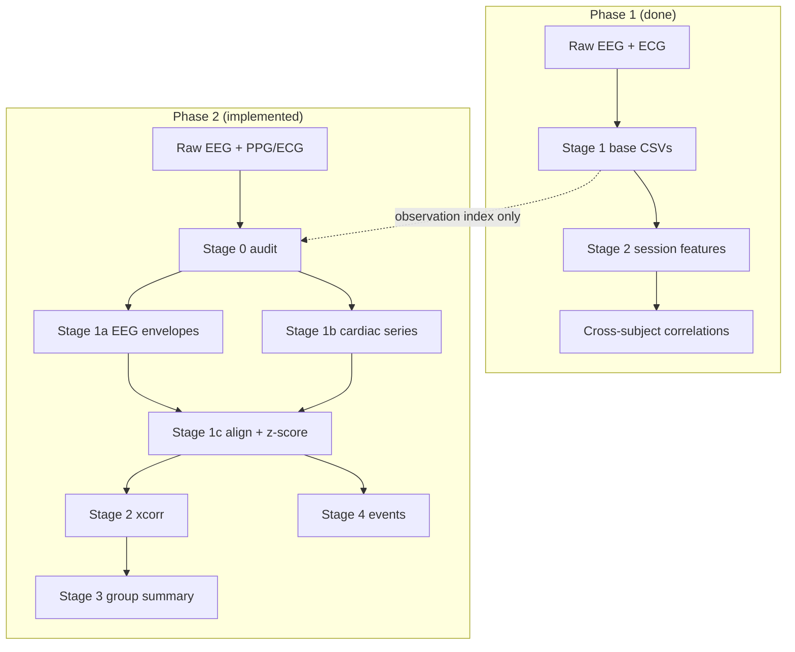

# Temporal EEG–Cardiac Coupling (Within-Subject Analysis)

This folder is the home for the **second analysis phase** of the EEG–PPG project. The first phase asked: *“Do people with higher theta also tend to have higher heart rate?”* (between subjects). This phase asks: *“When **one person’s** heart rate goes up, does their brain activity change a few seconds before or after?”* (within subject, over time).

---

## What Are We Doing?

Imagine you are watching a movie of **one person’s** brain and heart at the same time.

- The **brain** hums in different “speeds” (slow theta, medium alpha, fast beta). We measure how loud each hum is, moment by moment.
- The **heart** beats faster or slower. We measure heart rate (HR) and how “wiggly” the beat timing is (HRV: RMSSD, SDNN).

**The big question:** When the heart does something interesting, does the brain already know? Or does the brain change first and the heart follows?

We answer that in two ways:

1. **Lagged cross-correlation** — slide two timelines past each other and ask: “At what time offset do they match best?”
2. **Event-triggered averages** — pick big heart-rate jumps (or big brain bursts) and average what happened just before and after.

---

## Simple Analogy: Two Friends Walking

Think of EEG and heart rate as two friends walking side by side, each with a pedometer that beeps every second.

| What we measure | Friend A (Brain) | Friend B (Heart) |
|-----------------|------------------|------------------|
| Signal | How loud theta/alpha/beta is | HR, RMSSD, SDNN |
| Question | Who starts walking faster first? | |

- **Negative lag** → Friend A (brain) moved first → *brain may drive the heart*
- **Positive lag** → Friend B (heart) moved first → *heart may drive the brain*
- **Lag near zero** → they stepped together → *shared cause or tight coupling*

We do this **separately for each person**, then combine results at the group level.

---

## Implementation Status

| Stage | Description | Status |
|-------|-------------|--------|
| **0** | Data audit (preflight) | ✅ Done |
| **1a** | EEG Hilbert envelopes + QC plots | ✅ Done |
| **1b** | Cardiac HR/HRV time series + peak-detection QC | ✅ Done |
| **1c** | Merge, resample, z-score → aligned CSV | ✅ Done |
| **2** | Lagged cross-correlation (per subject) | ✅ Done |
| **3** | Group cross-correlation summary | ✅ Done |
| **4** | Event-triggered analysis | ✅ Done |

Validated on **ds003838 rest**:
- Smoke: sub-033, sub-036, sub-038 (`config.smoke.ds003838.temporal_coupling.yaml`)
- Validation: 8 subjects (`config.validation.ds003838.temporal_coupling.yaml`)

Stages 2–4 read `features_temporal_aligned.csv` only — no raw EEG/cardiac reload needed to rerun analysis.

---

## Pipeline Stages (Plain English)

### Stage 0 — Data audit (preflight) ✅

Check each observation has enough continuous EEG + cardiac overlap before processing.

**Output:** `group/data_audit.csv` — durations, sfreq, `usable`, `recommended_max_lag_s`.

---

### Stage 1 — Temporal feature extraction (three CSVs) ✅

**Goal:** Turn raw signals into aligned, comparable time series.

| Step | What | Output file |
|------|------|-------------|
| 1a | Raw EEG → Hilbert band envelopes (theta/alpha/beta) | `features_temporal_eeg_envelope.csv` |
| 1b | Raw ECG/PPG → HR + sliding-window RMSSD/SDNN | `features_temporal_cardiac.csv` |
| 1c | Merge, resample, z-score within subject | `features_temporal_aligned.csv` |

#### Stage 1a QC

Per subject: envelope debug plots, timeseries, optional PSD. Group: `group/eeg_envelope_qc.csv`.

Envelopes are downsampled before write (smoke: **10 Hz**) to keep CSVs small.

#### Stage 1b QC

Per subject: channel inventory, peak-detector comparison, detected peaks, debug plots. Group: `group/cardiac_qc.csv`.

Auto mode selects channel, detector, and polarity by quality score.

**`features_temporal_aligned.csv` columns (z-scored):**

`dataset_id | subject_id | task | observation_id | time_s | hr | rmssd | sdnn | mean_rr | theta_env | alpha_env | beta_env | hr_z | rmssd_z | sdnn_z | mean_rr_z | theta_env_z | alpha_env_z | beta_env_z`

Group: `group/alignment_qc.csv`

---

### Stage 2 — Lagged cross-correlation (per subject) ✅

**Goal:** For each brain–heart pair, find the best time alignment.

For each pair (e.g. HR ↔ theta envelope):
1. Compute correlation at lags up to `lag_max_s` (typically ±60 s for short rest).
2. Record peak signed r, peak lag, edge flags, optional permutation null.
3. Write per-subject peaks/curves and group aggregates.

**Lag sign cheat sheet:**

| Peak lag | Meaning |
|----------|---------|
| Negative | EEG changed *before* HR → brain → heart |
| Positive | HR changed *before* EEG → heart → brain |
| ~0 | Simultaneous or common driver |

**Per-subject outputs:** `cross_correlation_peaks.csv`, `cross_correlation_curves.csv`, QC plots.

**Group outputs:** `group/cross_correlation_peaks.csv`, `group/cross_correlation_curves.csv`, `group/cross_correlation_qc_summary.csv`, QC plots.

---

### Stage 3 — Group summary ✅

**Goal:** See if patterns repeat across people.

Collect one row per subject per pair, then summarize peak correlation and peak lag at the group level (median/mean, FDR where configured).

**Group outputs:**
- `peak_correlation_summary.csv`
- `group_cross_correlation_summary.csv`
- `mean_cross_correlation_curves.csv`
- `stage3_interpretation_notes.txt`
- Mean ± SEM grid, heatmaps, peak lag/r distribution plots

---

### Stage 4 — Event-triggered analysis ✅

**Goal:** Zoom in on dramatic moments with subject-balanced group averages.

**Averaging method:** `subject_mean_then_group_mean`
1. Average accepted events **within each subject** first.
2. Average **one trajectory per subject** across subjects.

Subjects with many events do **not** dominate the group curve.

#### Heart-led events (HR → EEG)

- Compute ΔHR z-score over `hr_delta_window_s` (default 15 s).
- Top/bottom tail events (default top/bottom 10%).
- Extract ±`epoch_pre_s` / ±`epoch_post_s` epochs of `theta_env_z`, `alpha_env_z`, `beta_env_z`.

#### Brain-led events (EEG → cardiac)

Configurable per band (`fixed_z` or `percentile`):

| Event | Default detection |
|-------|-------------------|
| Theta burst | top 10% `theta_env_z`, ≥ 2 s, min distance between onsets |
| Alpha suppression | bottom 10% `alpha_env_z`, ≥ 2 s, min distance |
| Beta burst | top 10% `beta_env_z`, ≥ 2 s, min distance |

Extract `hr_z`, `rmssd_z`, `sdnn_z` around each accepted event.

#### Usability thresholds (group plots)

| Rule | Default |
|------|---------|
| Minimum total events | 10 |
| Minimum contributing subjects | 4 |

Event types below these thresholds are marked **exploratory/insufficient** in QC and plot titles.

**Validation cohort (8 subjects) status:**
- HR increase / decrease: usable (40 events, 8 subjects)
- Beta burst: usable but cautious (10 events, 7 subjects)
- Theta burst: exploratory (8 events, 5 subjects)
- Alpha suppression: exploratory (5 events, 5 subjects)

**Group outputs:**
- `event_counts.csv` — per-subject accepted event counts
- `event_list.csv` — every detected event with acceptance/rejection
- `event_qc.csv` — group usability summary + averaging metadata
- `event_triggered_hr_to_eeg.csv` — group HR→EEG curves
- `event_triggered_eeg_to_hr.csv` — group EEG→cardiac curves
- `event_triggered_hr_to_eeg.png`, `event_triggered_eeg_to_hr.png`
- `stage4_interpretation_notes.txt`

**Interpretation (validation run):**
- HR-triggered EEG plots are the most reliable Stage 4 result.
- EEG-triggered cardiac plots are exploratory, especially theta and alpha.
- No biological conclusions until the full cohort is run.

---

## How This Fits the Existing Repo



| Phase | Question | Unit of analysis |
|-------|----------|------------------|
| Phase 1 | Do high-theta *people* have high HR? | One number per subject |
| Phase 2 | When HR *changes*, does theta change too — and when? | Every second, per subject |

---

## Directory Layout

```
temporal_coupling/          ← you are here (docs)
  README.md                 ← ELI10 overview (this file)
  IMPLEMENTATION_PLAN.md    ← technical build plan

config.smoke.ds003838.temporal_coupling.yaml       ← 3-subject smoke test
config.validation.ds003838.temporal_coupling.yaml  ← 8-subject validation
config.run.ds003838.temporal_coupling.yaml         ← full-dataset run config

ppg_eeg/temporal_coupling/  ← Python module
  __main__.py               ← CLI entry
  config.py
  run.py
  data_audit.py             ← Stage 0
  eeg_envelope.py           ← Stage 1a
  cardiac_common.py         ← shared peak/IBI helpers
  cardiac_detectors.py      ← ECG R-peak / PPG detectors
  cardiac_timeseries.py     ← Stage 1b
  resample.py               ← Stage 1c
  cross_correlation.py      ← Stage 2
  group_summary.py          ← Stage 3
  events.py                 ← Stage 4

derivatives/validation_ds003838_temporal_coupling/  ← validation outputs
  ds003838/
    sub-033/
      features_temporal_aligned.csv
      cross_correlation_peaks.csv
      cross_correlation_curves.csv
      ...
    group/
      data_audit.csv
      alignment_qc.csv
      cross_correlation_peaks.csv
      peak_correlation_summary.csv
      event_counts.csv
      event_list.csv
      event_qc.csv
      event_triggered_hr_to_eeg.csv
      event_triggered_hr_to_eeg.png
      stage4_interpretation_notes.txt
      ...
```

---

## Running

```bash
# Stage 0: audit
python -m ppg_eeg.temporal_coupling \
  --config config.smoke.ds003838.temporal_coupling.yaml \
  --stage 0

# Stage 1: envelopes + cardiac + alignment (or run 1a/1b/1c individually)
python -m ppg_eeg.temporal_coupling \
  --config config.smoke.ds003838.temporal_coupling.yaml \
  --stage 1

# Stages 2–4 (read aligned CSVs only)
python -m ppg_eeg.temporal_coupling \
  --config config.validation.ds003838.temporal_coupling.yaml \
  --stage 2

python -m ppg_eeg.temporal_coupling \
  --config config.validation.ds003838.temporal_coupling.yaml \
  --stage 3

python -m ppg_eeg.temporal_coupling \
  --config config.validation.ds003838.temporal_coupling.yaml \
  --stage 4

# Full pipeline
python -m ppg_eeg.temporal_coupling \
  --config config.run.ds003838.temporal_coupling.yaml \
  --stage all
```

**Valid `--stage` values:** `0`, `1`, `1a`, `1b`, `1c`, `2`, `3`, `4`, `all`

Stage `1` runs 1a + 1b + 1c together.

---

## Smoke Test Results (ds003838 rest)

| Subject | EEG usable | Cardiac channel | Detector | Median HR | Usable HR/HRV |
|---------|------------|-----------------|----------|-----------|---------------|
| sub-033 | yes | ECG (inverted) | ecg_rpeak | 79 bpm | yes / yes |
| sub-036 | yes | ECG (normal) | ecg_rpeak | 78 bpm | yes / yes |
| sub-038 | yes | ECG (normal) | ecg_rpeak | 71 bpm | yes / yes |

EEG envelopes: 0% NaNs, non-flat; FCz missing from montage (Fz+Cz used for theta/beta).

---

## Key Deliverables (per dataset)

- [x] `features_temporal_aligned.csv` (Stage 1c)
- [x] Mean cross-correlation curves across subjects (Stage 3)
- [x] Distribution of peak lags (Stage 3)
- [x] Distribution of peak correlation strengths (Stage 3)
- [x] Event-triggered average plots — HR-led and brain-led (Stage 4)
- [x] Event QC (`event_qc.csv`, `event_list.csv`, interpretation notes)
- [ ] Full-cohort biological interpretation (pending larger n)

See [IMPLEMENTATION_PLAN.md](./IMPLEMENTATION_PLAN.md) for module breakdown, parameters, QC file schemas, and build order.
