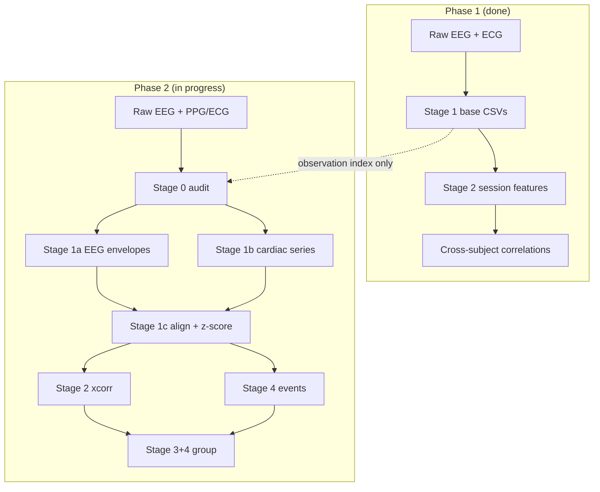

# Temporal EEG–Cardiac Coupling (Within-Subject Analysis)

This folder is the home for the **second analysis phase** of the EEG–PPG project. The first phase asked: *“Do people with higher theta also tend to have higher heart rate?”* (between subjects). This phase asks: *“When **one person’s** heart rate goes up, does their brain activity change a few seconds before or after?”* (within subject, over time).

---

## What Are We Doing?

Imagine you are watching a movie of **one person’s** brain and heart at the same time.

- The **brain** hums in different “speeds” (slow theta, medium alpha, fast beta). We measure how loud each hum is, moment by moment.
- The **heart** beats faster or slower. We measure heart rate (HR) and how “wiggly” the beat timing is (HRV: RMSSD, SDNN).

**The big question:** When the heart does something interesting, does the brain already know? Or does the brain change first and the heart follows?

We answer that in two ways:

1. **Lagged cross-correlation** — slide two timelines past each other and ask: “At what time offset do they match best?”
2. **Event-triggered averages** — pick big heart-rate jumps (or big brain bursts) and average what happened just before and after.

---

## Simple Analogy: Two Friends Walking

Think of EEG and heart rate as two friends walking side by side, each with a pedometer that beeps every second.

| What we measure | Friend A (Brain) | Friend B (Heart) |
|-----------------|------------------|------------------|
| Signal | How loud theta/alpha/beta is | HR, RMSSD, SDNN |
| Question | Who starts walking faster first? | |

- **Negative lag** → Friend A (brain) moved first → *brain may drive the heart*
- **Positive lag** → Friend B (heart) moved first → *heart may drive the brain*
- **Lag near zero** → they stepped together → *shared cause or tight coupling*

We do this **separately for each person**, then combine results at the group level.

---

## Implementation Status

| Stage | Description | Status |
|-------|-------------|--------|
| **0** | Data audit (preflight) | ✅ Done |
| **1a** | EEG Hilbert envelopes + QC plots | ✅ Done |
| **1b** | Cardiac HR/HRV time series + peak-detection QC | ✅ Done |
| **1c** | Merge, resample, z-score → aligned CSV | ⏳ Not yet |
| **2** | Lagged cross-correlation | ⏳ Not yet |
| **3** | Group summary | ⏳ Not yet |
| **4** | Event-triggered analysis | ⏳ Not yet |

Smoke-tested on **ds003838 rest** (sub-033, sub-036, sub-038).

---

## Pipeline Stages (Plain English)

### Stage 0 — Data audit (preflight) ✅

Check each observation has enough continuous EEG + cardiac overlap before processing.

**Output:** `group/data_audit.csv` — durations, sfreq, `usable`, `recommended_max_lag_s`.

---

### Stage 1 — Temporal feature extraction (three CSVs)

**Goal:** Turn raw signals into aligned, comparable time series. This is one stage that writes **three files** per subject×observation.

| Step | What | Output file | Status |
|------|------|-------------|--------|
| 1a | Raw EEG → Hilbert band envelopes (theta/alpha/beta) | `features_temporal_eeg_envelope.csv` | ✅ |
| 1b | Raw ECG/PPG → HR + sliding-window RMSSD/SDNN | `features_temporal_cardiac.csv` | ✅ |
| 1c | Merge, resample, z-score within subject | `features_temporal_aligned.csv` | ⏳ |

Stages 2–4 will read `features_temporal_aligned.csv` — no raw I/O needed to rerun analysis.

#### Stage 1a QC (implemented)

Per subject:

- `eeg_envelope_debug_user_window.png` — raw / filtered / envelope panels (theta, alpha, beta)
- `eeg_envelope_debug_auto_window.png` — auto-selected representative window
- `eeg_envelope_timeseries.png` — full-recording ROI-averaged envelopes
- `eeg_psd_debug.png` — optional PSD with band regions shaded

Group: `group/eeg_envelope_qc.csv`

Envelopes are downsampled before write (smoke: **10 Hz**) to keep CSVs small.

#### Stage 1b QC (implemented)

Per subject:

- `cardiac_channel_inventory.csv`, `cardiac_channel_preview.png`
- `peak_detector_comparison.csv` — simple vs `ecg_rpeak` vs `ppg_peak`
- `detected_peaks.csv`
- `cardiac_peak_detection_debug_10s_user_window.png`
- `cardiac_peak_detection_debug_10s_auto_window.png`
- `cardiac_peak_detection_debug_40s_overview.png`

Group: `group/cardiac_qc.csv`

Auto mode selects channel, detector, and polarity by quality score. ECG uses **5–30 Hz bandpass + prominence-based R-peak detection**.

**`features_temporal_aligned.csv` columns (planned, z-scored):**

`dataset_id | subject_id | observation_id | time_s | hr_z | rmssd_z | sdnn_z | mean_rr_z | theta_env_z | alpha_env_z | beta_env_z`

---

### Stage 2 — Lagged cross-correlation (per subject) ⏳

**Goal:** For each brain–heart pair, find the best time alignment.

For each pair (e.g. HR ↔ theta envelope):
1. Compute correlation at lags up to **±recommended_max_lag_s** (typically ±60 s for 4-min recordings).
2. Record peak signed r, peak lag, and direction.
3. **Permutation check:** circularly shift one signal many times; compare observed peak |r| to null.

**Lag sign cheat sheet:**

| Peak lag | Meaning |
|----------|---------|
| Negative | EEG changed *before* HR → brain → heart |
| Positive | HR changed *before* EEG → heart → brain |
| ~0 | Simultaneous or common driver |

---

### Stage 3 — Group summary ⏳

**Goal:** See if patterns repeat across people.

Collect one row per subject per pair, then test whether peak correlation and peak lag are consistently non-zero.

**Deliverables:** mean cross-correlation curves, histograms of peak lags and peak r values.

---

### Stage 4 — Event-triggered analysis ⏳

**Goal:** Zoom in on dramatic moments.

**Heart-led events (HR *changes*, not high HR):**
- Compute ΔHR over 10–20 s; find top 10% increases and top 10% decreases.
- Average EEG envelopes in ±60 s epochs around each event.

**Brain-led events (on z-scored envelopes):**
- Theta burst / alpha suppression / beta burst (±2 SD for ≥ 2 s).
- Average HR trajectory in ±60 s epochs.

---

## How This Fits the Existing Repo



| Phase | Question | Unit of analysis |
|-------|----------|------------------|
| Phase 1 | Do high-theta *people* have high HR? | One number per subject |
| Phase 2 | When HR *changes*, does theta change too — and when? | Every second, per subject |

---

## Directory Layout

```
temporal_coupling/          ← you are here (docs)
  README.md                 ← ELI10 overview (this file)
  IMPLEMENTATION_PLAN.md    ← technical build plan

config.smoke.ds003838.temporal_coupling.yaml   ← 3-subject smoke test
config.run.ds003838.temporal_coupling.yaml    ← full-dataset run config

ppg_eeg/temporal_coupling/  ← Python module
  __main__.py               ← CLI entry
  config.py
  run.py
  data_audit.py             ← Stage 0
  eeg_envelope.py           ← Stage 1a
  cardiac_common.py         ← shared peak/IBI helpers
  cardiac_detectors.py      ← ECG R-peak / PPG detectors
  cardiac_timeseries.py     ← Stage 1b
  resample.py               ← Stage 1c (planned)
  cross_correlation.py      ← Stage 2 (planned)
  group_summary.py          ← Stage 3 (planned)
  events.py                 ← Stage 4 (planned)

derivatives/smoke_ds003838_temporal_coupling/  ← smoke outputs
  ds003838/
    sub-033/
      features_temporal_eeg_envelope.csv
      features_temporal_cardiac.csv
      detected_peaks.csv
      eeg_envelope_debug_*.png
      eeg_envelope_timeseries.png
      cardiac_peak_detection_debug_*.png
      ...
    group/
      data_audit.csv
      eeg_envelope_qc.csv
      cardiac_qc.csv
```

---

## Running

```bash
# Smoke test (3 subjects, ds003838 rest)
python -m ppg_eeg.temporal_coupling \
  --config config.smoke.ds003838.temporal_coupling.yaml \
  --stage 0

python -m ppg_eeg.temporal_coupling \
  --config config.smoke.ds003838.temporal_coupling.yaml \
  --stage 1a

python -m ppg_eeg.temporal_coupling \
  --config config.smoke.ds003838.temporal_coupling.yaml \
  --stage 1b

# Full dataset (once Stage 1c+ are implemented)
python -m ppg_eeg.temporal_coupling \
  --config config.run.ds003838.temporal_coupling.yaml \
  --stage all
```

**Valid `--stage` values:** `0`, `1`, `1a`, `1b`, `1c`, `2`, `3`, `4`, `all`

Stage `1` runs 1a + 1b + 1c together (1c not yet available).

---

## Smoke Test Results (ds003838 rest)

| Subject | EEG usable | Cardiac channel | Detector | Median HR | Usable HR/HRV |
|---------|------------|-----------------|----------|-----------|---------------|
| sub-033 | yes | ECG (inverted) | ecg_rpeak | 79 bpm | yes / yes |
| sub-036 | yes | ECG (normal) | ecg_rpeak | 78 bpm | yes / yes |
| sub-038 | yes | ECG (normal) | ecg_rpeak | 71 bpm | yes / yes |

EEG envelopes: 0% NaNs, non-flat; FCz missing from montage (Fz+Cz used for theta/beta).

---

## Key Deliverables (per dataset)

- [ ] `features_temporal_aligned.csv` (Stage 1c)
- [ ] Mean cross-correlation curves across subjects (Stage 3)
- [ ] Distribution of peak lags (Stage 3)
- [ ] Distribution of peak correlation strengths (Stage 3)
- [ ] Event-triggered average plots — HR-led and brain-led (Stage 4)
- [ ] Summary table: theta leads HR? HR leads theta? alpha suppression with HR spikes?

See [IMPLEMENTATION_PLAN.md](./IMPLEMENTATION_PLAN.md) for module breakdown, parameters, QC file schemas, and build order.
