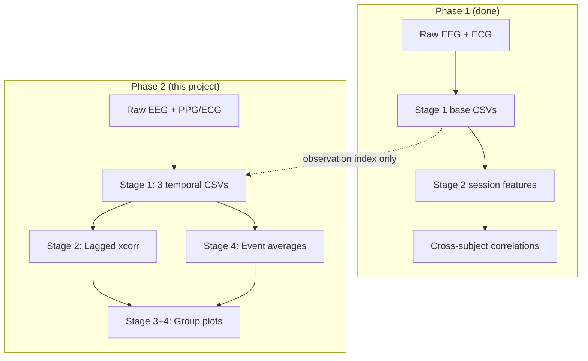

# Temporal EEG–Cardiac Coupling (Within-Subject Analysis)

This folder is the home for the **second analysis phase** of the EEG–PPG project. The first phase asked: *“Do people with higher theta also tend to have higher heart rate?”* (between subjects). This phase asks: *“When **one person’s** heart rate goes up, does their brain activity change a few seconds before or after?”* (within subject, over time).

---

## What Are We Doing?

Imagine you are watching a movie of **one person’s** brain and heart at the same time.

- The **brain** hums in different “speeds” (slow theta, medium alpha, fast beta). We measure how loud each hum is, moment by moment.
- The **heart** beats faster or slower. We measure heart rate (HR) and how “wiggly” the beat timing is (HRV: RMSSD, SDNN).

**The big question:** When the heart does something interesting, does the brain already know? Or does the brain change first and the heart follows?

We answer that in two ways:

1. **Lagged cross-correlation** — slide two timelines past each other and ask: “At what time offset do they match best?”
2. **Event-triggered averages** — pick big heart-rate jumps (or big brain bursts) and average what happened just before and after.

---

## Simple Analogy: Two Friends Walking

Think of EEG and heart rate as two friends walking side by side, each with a pedometer that beeps every second.

| What we measure | Friend A (Brain) | Friend B (Heart) |
|-----------------|------------------|------------------|
| Signal | How loud theta/alpha/beta is | HR, RMSSD, SDNN |
| Question | Who starts walking faster first? | |

- **Negative lag** → Friend A (brain) moved first → *brain may drive the heart*
- **Positive lag** → Friend B (heart) moved first → *heart may drive the brain*
- **Lag near zero** → they stepped together → *shared cause or tight coupling*

We do this **separately for each person**, then combine results at the group level.

---

## Pipeline Stages (Plain English)

### Stage 0 — Data audit (preflight)

Check each observation has enough continuous EEG + PPG overlap and beats before processing.

---

### Stage 1 — Temporal feature extraction (three CSVs)

**Goal:** Turn raw signals into aligned, comparable time series. This is one stage that writes **three files** per subject×observation (like Phase 1 Stage 1 writes base CSVs).

| Step | What | Output file |
|------|------|-------------|
| 1a | Raw EEG → Hilbert band envelopes (theta/alpha/beta) | `features_temporal_eeg_envelope.csv` |
| 1b | Raw PPG/ECG → HR + sliding-window RMSSD/SDNN | `features_temporal_cardiac.csv` |
| 1c | Merge, resample to 2 Hz, z-score within subject | `features_temporal_aligned.csv` |

**`features_temporal_aligned.csv` columns (z-scored):**

`dataset_id | subject_id | observation_id | time_s | hr_z | rmssd_z | sdnn_z | mean_rr_z | theta_env_z | alpha_env_z | beta_env_z`

Stages 2–4 read only this file — no raw I/O needed to rerun analysis.

---

### Stage 2 — Lagged cross-correlation (per subject)

**Goal:** For each brain–heart pair, find the best time alignment.

For each pair (e.g. HR ↔ theta envelope):
1. Compute correlation at lags up to **±recommended_max_lag_s** (typically ±60 s for 4-min recordings, not ±300 s).
2. Record peak signed r, peak lag, and direction.
3. **Permutation check:** circularly shift one signal many times; compare observed peak |r| to null — avoids false peaks from searching many lags.

**Lag sign cheat sheet:**

| Peak lag | Meaning |
|----------|---------|
| Negative | EEG changed *before* HR → brain → heart |
| Positive | HR changed *before* EEG → heart → brain |
| ~0 | Simultaneous or common driver |

---

### Stage 3 — Group summary

**Goal:** See if patterns repeat across people.

Collect one row per subject per pair:

| subject | pair | peak_r | peak_lag_s |
|---------|------|--------|------------|
| sub-001 | HR-Theta | … | … |

Then test:
- Is peak correlation consistently ≠ 0?
- Is peak lag consistently positive or negative?

**Deliverables:** mean cross-correlation curves, histograms of peak lags and peak r values.

---

### Stage 4 — Event-triggered analysis

**Goal:** Zoom in on dramatic moments.

**Heart-led events (HR *changes*, not high HR):**
- Compute ΔHR over 10–20 s; find top 10% increases and top 10% decreases.
- Average EEG envelopes in ±60 s epochs around each event.

**Brain-led events (on z-scored envelopes):**
- Theta burst / alpha suppression / beta burst (±2 SD for ≥ 2 s).
- Average HR trajectory in ±60 s epochs.

This often gives a clearer picture than correlation alone.

---

## How This Fits the Existing Repo



| Phase | Question | Unit of analysis |
|-------|----------|------------------|
| Phase 1 | Do high-theta *people* have high HR? | One number per subject |
| Phase 2 | When HR *changes*, does theta change too — and when? | Every second, per subject |

---

## Directory Layout

```
temporal_coupling/          ← you are here (docs + plan)
  README.md                 ← ELI10 overview (this file)
  IMPLEMENTATION_PLAN.md    ← technical build plan

config.run.ds003838.temporal_coupling.yaml   ← run config (repo root)

ppg_eeg/temporal_coupling/  ← Python module (to be implemented)
  ...

derivatives/run_ds003838_temporal_coupling/  ← outputs (gitignored)
  ds003838/
    sub-001/
      features_temporal_eeg_envelope.csv
      features_temporal_cardiac.csv
      features_temporal_aligned.csv
      cross_correlation_peaks.csv
      ...
    group/
      mean_xcorr_curves.png
      peak_lag_distribution.png
      event_triggered_hr_increase.png
      summary_table.csv
```

---

## Running (once implemented)

```bash
# Start with ds003838 (same raw data as Phase 1)
python -m ppg_eeg.temporal_coupling --config config.run.ds003838.temporal_coupling.yaml
```

Outputs land under `derivatives/run_ds003838_temporal_coupling/`.

---

## Key Deliverables (per dataset)

- [ ] Mean cross-correlation curves across subjects
- [ ] Distribution of peak lags
- [ ] Distribution of peak correlation strengths
- [ ] Event-triggered average plots (HR-led and brain-led)
- [ ] Summary table: theta leads HR? HR leads theta? alpha suppression with HR spikes? beta tracks autonomic activation?

See [IMPLEMENTATION_PLAN.md](./IMPLEMENTATION_PLAN.md) for module breakdown, parameters, and build order.
